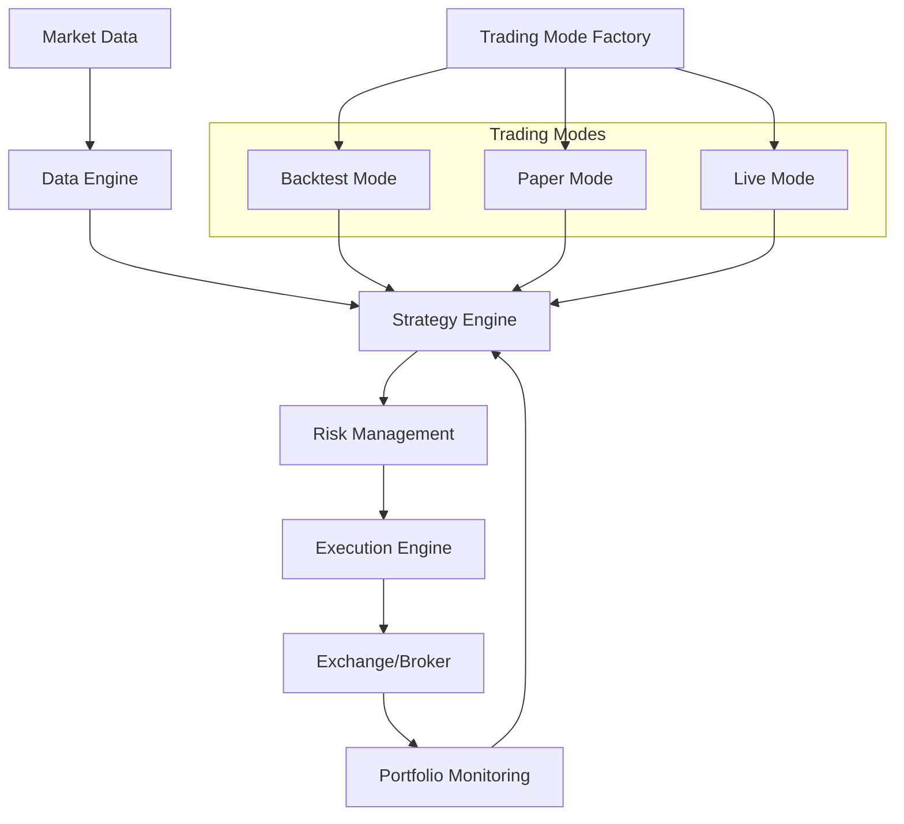

# Crypto Quantitative Trading System


[](https://github.com/psf/black)

## 🚀 Project Overview

A modular, high-performance quantitative trading system designed for cryptocurrency markets, supporting comprehensive trading workflows from historical backtesting to live trading execution.

## 🌟 Key Features

### Advanced Trading Capabilities

- **Multi-Mode Trading**
  - Backtest Mode
  - Paper Trading Mode
  - Live Trading Mode
- **Flexible Strategy Framework**
- **Comprehensive Risk Management**
- **Performance Monitoring**

### Technical Highlights

- Asynchronous Architecture
- Modular Design
- Multi-Asset Support
- Real-time Data Processing
- Advanced Error Handling

## 🔧 Architecture



## 📦 Core Components

1. **Launcher**: System entry point
2. **Trading Mode Factory**: Dynamic mode creation
3. **Data Manager**: Unified data source interface
4. **Strategy Engine**: Dynamic strategy loading
5. **Risk Management**: Advanced risk controls
6. **Execution Engine**: Multi-order type support
7. **Performance Monitor**: Comprehensive metrics tracking

## 🛠 Technologies

- **Language**: Python 3.8+
- **Async Processing**: asyncio
- **Data Analysis**: Pandas, NumPy
- **Configuration**: PyYAML
- **Exchange Integration**: CCXT

## 🚀 Quick Start

### Prerequisites

- Python 3.8+
- Redis (optional, for caching)
- PostgreSQL (recommended for production)

### Installation

1. Clone repository:

```bash
git clone https://github.com/your-username/crypto-trading-system.git
cd crypto-trading-system
```

2. Create virtual environment:

```bash
python -m venv .venv
source .venv/bin/activate  # Linux/macOS
.venv\Scripts\activate     # Windows
```

3. Install dependencies:

```bash
pip install -r requirements.txt
```

4. Configuration:

```bash
cp config/config.example.yaml config/config.yaml
# Edit config.yaml with your credentials and settings
```

5. Run the system:

```bash
# Windows
cd scripts
./run.bat

# Linux/macOS
cd scripts
./run.sh

# Or directly via Python
python src/bin/main.py --mode backtest  # Available modes: backtest/paper/live
```

## 📊 Trading Modes

### Backtest Mode

- Historical data simulation
- Performance metrics generation
- Risk analysis

### Paper Trading Mode

- Real-time market data
- Simulated order execution
- No real capital risk

### Live Trading Mode

- Real exchange integration
- Actual order execution
- Advanced risk management

## 🔒 Security Considerations

- API key encryption
- Position size limits
- Drawdown protection
- Emergency stop mechanisms

## 🧪 Testing

```bash
# Run test suite
pytest tests/ --cov=src --cov-report=html
```

## 🚧 Project Structure

```
.
├── config/                 # Configuration files
├── data/                   # Data storage
├── docs/                   # Documentation
├── logs/                   # Operational logs
├── scripts/                # Executable scripts
├── src/                    # Source code
│   ├── backtest/           # Backtesting framework
│   ├── core/               # System core
│   ├── data/               # Data management
│   ├── exchange/           # Exchange integrations
│   ├── execution/          # Order execution
│   ├── mode/               # Trading mode implementations
│   ├── portfolio/          # Portfolio management
│   ├── risk/               # Risk management
│   ├── strategies/         # Trading strategies
│   └── utils/              # Utilities
├── tests/                  # Test suite
└── tmp/                    # Temporary files
```

## 🤝 Contributing

1. Fork the repository
2. Create feature branch: `git checkout -b feature/your-feature`
3. Commit changes: `git commit -m "feat: add new feature"`
4. Push to branch: `git push origin feature/your-feature`
5. Open pull request

### Commit Message Format

- `feat`: New features
- `fix`: Bug fixes
- `docs`: Documentation changes
- `test`: Test-related changes
- `refactor`: Code refactoring

## 📄 License

MIT License

## ⚠️ Disclaimer

🚨 **WARNING**:

- Trading cryptocurrencies involves significant financial risk
- This system is for educational/research purposes only
- Past performance does not guarantee future results
- Always trade responsibly with capital you can afford to lose

## 📞 Contact

- Project Lead: Jacky Li
- Email: 2354889815@qq.com

---

**Remember**: Algorithmic trading requires thorough understanding, continuous learning, and responsible risk management.
