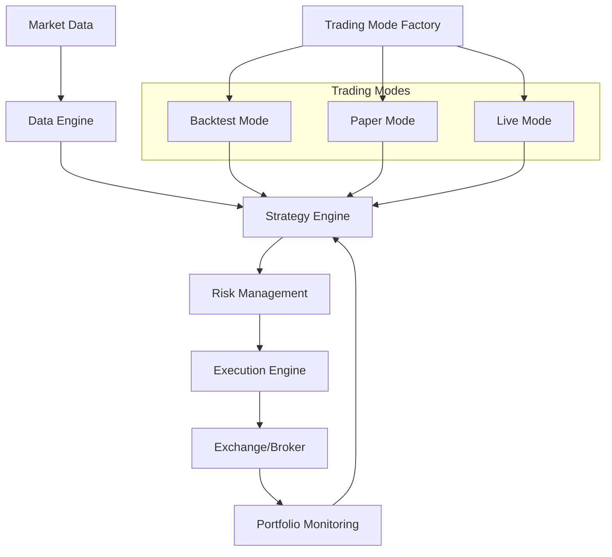

# Quantitative Trading System - Project Documentation


[](https://github.com/psf/black)

## Overview

A modular quantitative trading system supporting multi-asset automated trading across cryptocurrency markets. Provides a complete workflow from data acquisition, strategy research, backtesting to live trading execution. Designed for extensibility to traditional financial markets.

---

## Key Features

* **Multi-Market Support** : Integrated APIs for major crypto exchanges (Binance, OKX, etc.)
* **Modular Strategies** : Factor investing, machine learning, and hybrid approaches
* **End-to-End Solution** : Data pipeline → Alpha research → Risk management → Execution
* **Trading Modes** : Backtest, paper trading, and live trading with consistent interfaces
* **Production-Grade** :
* Asynchronous I/O architecture
* Multi-layer risk control system
* Real-time performance monitoring
* **Extensible** :
* Plugin-style strategy development
* Customizable data connectors
* Multi-broker support

---

## Architecture



---

## Project Structure

```
.
├── bin/                    # Executable scripts
│   ├── run.sh              # Main execution script
│   └── start.py            # Alternative entry point
├── config/                 # Configuration files
│   ├── config.yaml         # Main configuration
│   └── config_generator.py
├── data/                   # Data storage
│   ├── raw/                # Raw market data
│   ├── processed/          # Processed datasets
│   └── libraries/          # Reference data
├── docs/                   # Documentation
├── logs/                   # Operational logs
├── src/                    # Source code
│   ├── backtest/           # Backtesting framework
│   ├── core/               # System core
│   │   └── core.py         # Central coordinator
│   ├── data/               # Data management
│   ├── exchange/           # Exchange integrations
│   ├── execution/          # Order execution
│   ├── mode/               # Trading mode implementations
│   │   ├── base_trading_mode.py    # Base class for all modes
│   │   ├── backtest_trading_mode.py # Backtest specific implementation
│   │   ├── paper_trading_mode.py   # Paper trading implementation
│   │   ├── live_trading_mode.py    # Live trading implementation
│   │   └── trading_mode_factory.py # Factory for mode creation
│   ├── portfolio/          # Portfolio management
│   ├── risk/               # Risk management
│   ├── strategies/         # Trading strategies
│   └── utils/              # Utilities
├── tests/                  # Test suite
└── tmp/                    # Temporary files
```

---

## Quick Start

### Prerequisites

* Python 3.8+
* Redis (optional, for caching)
* PostgreSQL (recommended for production)

### Installation

1. Clone repository:
   ```bash
   git clone https://github.com/your-org/quant-trading-system.git
   cd quant-trading-system
   ```
2. Create virtual environment:
   ```bash
   python -m venv .venv
   source .venv/bin/activate  # Linux/macOS
   .venv\Scripts\activate     # Windows
   ```
3. Install dependencies:
   ```bash
   pip install -r docs/requirements.txt
   ```
4. Configuration:
   ```bash
   cp config/config.example.yaml config/config.yaml
   # Edit config.yaml with your credentials and settings
   ```
5. Run system:
   ```bash
   python src/bin/main.py --mode backtest  # Available modes: backtest/paper/live
   ```

---

## Backtesting Framework

### Features

* Multi-asset backtesting support
* Realistic transaction cost modeling
* Comprehensive performance metrics
* Flexible configuration options

### Running Backtest

```bash
# Basic backtest
python src/bin/main.py --mode backtest

# Specify configuration
python src/bin/main.py --mode backtest --config path/to/custom_backtest_config.yaml
```

### Backtest Configuration

```yaml
backtest:
  mode: full            # Backtest mode (full/single_pass/walk_forward)
  start_date: "2022-01-01"
  end_date: "2023-12-31"
  initial_capital: 100000
  symbols: ["BTC/USDT", "ETH/USDT"]
  timeframe: "1h"

  transaction_costs:
    commission_rate: 0.001
    slippage: 0.001

  risk_parameters:
    max_drawdown: 0.2
    daily_loss_limit: 0.05
```

### Performance Reports

Backtest generates comprehensive reports:

* Trade log CSV
* Performance summary JSON
* Optional visualizations

Example metrics:

* Total Return
* Sharpe Ratio
* Maximum Drawdown
* Win Rate
* Profit Factor

### Strategy Development Guidelines

1. Implement `generate_signals()` in your strategy
2. Configure backtesting parameters
3. Run backtest to evaluate strategy performance
4. Iterate and optimize

### Best Practices

* Use realistic transaction cost parameters
* Test across multiple market conditions
* Compare strategy performance using walk-forward analysis
* Monitor risk metrics alongside returns

---

## Trading Modes System

The system supports three trading modes, each with a consistent interface but specialized implementations.

### Mode Architecture

* **BaseTradingMode** : Abstract base class defining common interface
* **BacktestTradingMode** : Historical data simulation
* **PaperTradingMode** : Real-time simulation with mock execution
* **LiveTradingMode** : Real-time trading with actual order execution
* **TradingModeFactory** : Central factory for creating appropriate mode instances

### Mode Selection

```bash
# Select mode via command line
python src/bin/main.py --mode backtest
python src/bin/main.py --mode paper
python src/bin/main.py --mode live

# Or specify in config.yaml
default_config:
  mode: "paper"  # Options: backtest, paper, live
```

### Mode-Specific Features

#### Backtest Mode

* Historical data processing
* Multi-asset correlation analysis
* Comprehensive performance reporting

#### Paper Mode

* Real-time data with simulated execution
* Realistic slippage and fee modeling
* Performance tracking without real capital

#### Live Mode

* Exchange connectivity verification
* Real order execution
* Detailed trade tracking
* Safety mechanisms for capital protection

### Trading Mode Factory

The system uses a factory pattern for mode creation, allowing for:

* Runtime mode selection based on configuration
* Consistent initialization interface
* Automatic component injection
* Proper lifecycle management

```python
# Example of mode creation using factory
mode_factory = TradingModeFactory(config)
trading_mode = await mode_factory.create_mode("paper")
results = await trading_mode.run(symbols, timeframe)
```

---

## Live Trading Guide

### Prerequisites

* Valid exchange API credentials
* Sufficient account balance
* Reliable network connection
* Dedicated trading machine/server

### Configuration

Create a `live_config.yaml` with your specific settings:

```yaml
live_trading:
  exchange:
    name: "binance"
    api:
      key: 'your_binance_api_key'
      secret: 'your_binance_api_secret'
    test_symbol: "BTC/USDT"  # Used for connectivity verification
  
  symbols: ['BTC/USDT', 'ETH/USDT']
  strategy: "dual_ma"
  strategy_params:
    short_period: 20
    long_period: 50
  
  # Account and risk parameters
  min_required_balance: 500  # Minimum USD balance to start trading
  status_interval: 3600      # Check account status every hour
  cancel_orders_on_shutdown: true
  
  risk_management:
    max_portfolio_risk: 0.05
    stop_loss_threshold: 0.1
```

### Running Live Trading

```bash
# Start live trading
python src/bin/main.py --mode live

# Use specific configuration
python src/bin/main.py --mode live --config path/to/live_config.yaml
```

### Safety Precautions

1. **Always start with paper trading**
2. Use small position sizes initially
3. Set strict risk management parameters
4. Monitor system continuously
5. Have manual intervention capabilities

### Risk Management Features

* Dynamic position sizing
* Real-time portfolio risk tracking
* Automatic stop-loss execution
* Emergency shutdown mechanism
* Detailed performance logging

### Monitoring

The system provides real-time monitoring through:

* Console logs
* Performance snapshots
* Optional notification systems (email, Telegram)

### Performance Metrics Tracked

* Portfolio Value
* Daily Returns
* Maximum Drawdown
* Win/Loss Ratio
* Transaction Costs

### Common Challenges & Solutions

#### API Connection Issues

* Check network stability
* Verify API credentials
* Implement robust reconnection logic

#### Market Volatility

* Use adaptive position sizing
* Implement volatility-based risk controls
* Have predefined exit strategies

### Disclaimer

⚠️  **WARNING** :

* Live trading involves significant financial risk
* Always trade with capital you can afford to lose
* Past performance does not guarantee future results
* Thoroughly test and understand the system before live deployment

### Best Practices

1. Start with minimal capital
2. Use testnet for initial validation
3. Continuously monitor and adjust strategy
4. Keep detailed trading logs
5. Regularly review and update risk parameters

---

## Advanced Tick-Level Backtesting

### Overview

Our backtesting framework provides a high-fidelity simulation of market conditions, supporting:

* Tick-level market replay
* Realistic transaction cost modeling
* Comprehensive risk and performance analysis

### Key Features

* **Granular Market Simulation**
  * Process individual market ticks
  * Simulate real-world trading conditions
  * Support for multi-symbol backtesting
* **Advanced Performance Tracking**
  * Detailed trade-by-trade logging
  * Comprehensive performance metrics
  * Risk-adjusted return calculations

### Backtesting Workflow

```python
from src.backtest.tick_backtest_engine import TickLevelBacktestEngine
from src.strategies.your_strategy import YourStrategy

# Load tick-level data
tick_data = load_tick_data('path/to/tick_data.csv')

# Configure backtest
config = {
    'commission_rate': 0.001,
    'slippage': 0.001,
    'max_position_size': 0.1
}

# Initialize strategy and backtest engine
strategy = YourStrategy(config)
backtest_engine = TickLevelBacktestEngine(
    tick_data=tick_data,
    strategy=strategy,
    config=config,
    initial_capital=100000
)

# Run backtest
results = backtest_engine.run()
```

### Performance Metrics

The backtest generates comprehensive reports including:

* Total Return
* Sharpe Ratio
* Sortino Ratio
* Maximum Drawdown
* Win Rate
* Profit Factor

### Visualization

Automatic generation of:

* Equity Curve
* Returns Distribution
* Drawdown Chart

### Configuration Options

```yaml
backtest:
  # Transaction Costs
  commission_rate: 0.001  # 0.1% commission
  slippage: 0.001         # 0.1% slippage

  # Risk Management
  max_position_size: 0.1  # Max 10% of portfolio per position
  
  # Data Sources
  tick_data_path: 'data/tick_data/'
  
  # Reporting
  report_format: 
    - csv
    - json
    - plots
```

### Data Requirements

Tick data should be a DataFrame with columns:

* `timestamp`: Precise market timestamp
* `price`: Tick price
* `volume`: Trade volume

### Best Practices

1. Use high-quality, cleaned tick data
2. Start with conservative risk parameters
3. Compare results across different market conditions
4. Validate strategy performance statistically

### Limitations

* Computational intensity for large datasets
* Assumes perfect order execution
* Historical data may not perfectly represent future markets

### Disclaimer

🚨  **WARNING** :

* Backtesting results do not guarantee future performance
* Always combine backtesting with forward testing and paper trading
* Market conditions change rapidly

---

## Core Modules

### Data Engine (`src/data/`)

* Unified data interface for:
  * Historical data (CSV/Parquet/Database)
  * Real-time streaming (WebSocket/REST)
* Data quality checks
* Caching mechanisms with TTL

### Strategy Engine (`src/strategies/`)

```python
# Example factor strategy
class MomentumStrategy(BaseStrategy):
    def generate_signals(self, data: pd.DataFrame) -> pd.DataFrame:
        returns = data.pct_change(periods=21)
        signals = returns.rank(axis=1, pct=True)
        return signals.iloc[-1] > 0.8
```

### Execution Engine (`src/execution/`)

* Smart order routing
* Slippage modeling
* Transaction cost analysis
* Supported order types:
  * Market/Limit/Stop/TWAP

### Trading Mode System (`src/mode/`)

* Common interface via `BaseTradingMode`
* Mode-specific implementations:
  ```python
  # Factory pattern for mode creationmode_factory = TradingModeFactory(config)trading_mode = await mode_factory.create_mode("paper")
  ```

### Risk Management (`src/risk/`)

* Real-time monitoring:
  * Position limits
  * Drawdown controls
  * Liquidity checks
* Circuit breakers:
  ```python
  if portfolio.drawdown > config.max_drawdown:    system.halt_trading()
  ```

---

## Development Guide

### Creating New Strategies

1. Implement strategy interface:
   ```python
   # src/strategies/my_strategy.py
   class MyStrategy(BaseStrategy):
       def __init__(self, config: dict):
           super().__init__(config)

       def generate_signals(self, data: dict) -> dict:
           # Strategy logic here
           return signals
   ```
2. Register strategy in factory:
   ```python
   # src/strategies/strategy_factory.py
   from .my_strategy import MyStrategy

   STRATEGY_MAP = {
       'my_strategy': MyStrategy,
       # Existing strategies...
   }
   ```
3. Update configuration:
   ```yaml
   # config.yaml
   strategy:
     type: "my_strategy"
     parameters:
       param1: value1
   ```

### Creating Custom Trading Modes

1. Extend the base trading mode:
   ```python
   # src/mode/custom_trading_mode.py
   class CustomTradingMode(BaseTradingMode):
       async def initialize(self) -> None:
           # Initialize mode specific components

       async def run(self, symbols: List[str], timeframe: str) -> Dict[str, Any]:
           # Implement trading loop

       async def shutdown(self) -> None:
           # Clean up resources
   ```
2. Add to trading mode factory:
   ```python
   # src/mode/trading_mode_factory.py
   from .custom_trading_mode import CustomTradingMode

   # In _create_mode_instance method:
   elif mode == TradingModeType.CUSTOM:
       return CustomTradingMode(config=self.config, **kwargs)
   ```
3. Register the new mode type:
   ```python
   # src/mode/trading_mode_factory.py
   class TradingModeType(Enum):
       # Existing modes...
       CUSTOM = "custom"
   ```

### Adding Exchange Support

1. Create exchange connector:
   ```python
   # src/exchange/new_exchange.py
   class NewExchange(ExchangeBase):
       async def connect(self):
           # Implement connection logic

       async def execute_order(self, order: Order):
           # Implement order execution
   ```
2. Add to exchange factory:
   ```python
   # src/exchange/__init__.py
   from .new_exchange import NewExchange

   EXCHANGE_MAP = {
       'new_exchange': NewExchange,
       # Existing exchanges...
   }
   ```

## Testing

Run full test suite:

```bash
pytest tests/ --cov=src --cov-report=html
```

Key test categories:

* Unit tests: `tests/unit/`
* Integration tests: `tests/integration/`
* Performance tests: `tests/performance/`

## Contribution

We welcome contributions following these guidelines:

1. Fork the repository
2. Create feature branch: `git checkout -b feature/your-feature`
3. Commit changes: `git commit -m "feat: add new feature"`
4. Push to branch: `git push origin feature/your-feature`
5. Open pull request

Commit message format:

* `feat`: New features
* `fix`: Bug fixes
* `docs`: Documentation changes
* `test`: Test-related changes
* `refactor`: Code refactoring

## License

This project is licensed under the MIT License - see [LICENSE](https://sx.xiaoai.shop/chat/LICENSE) file for details.

## Contact

* Project Lead: Jacky Li
* E-mail: 2354889815@qq.com

---

 **Disclaimer** : This system is for educational/research purposes only. Trading financial instruments carries substantial risk. Past performance is not indicative of future results.
