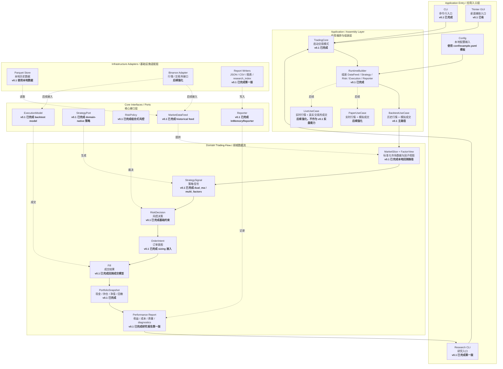

# crypto_trader

基于策略的加密货币量化交易研究项目。当前主能力是**本地历史 K 线回测**和**策略研究**；模拟盘和实盘链路已经有代码边界、执行模型与安全门，但现阶段不要把它们当作可投入资金运行的生产系统。

## 当前状态

- 已可用：本地回测、domain-native 策略、参数网格扫描、walk-forward 研究、报告与图表输出。
- 已有入口：CLI、Research CLI、Tkinter 桌面 GUI。
- 暂未完成生产能力：模拟盘长期运行、实盘自动下单、交易所 API 全链路验证、高频生产执行。

## 核心架构

下面是项目的目标架构，以及当前已完成的 v0.1 状态：


```mermaid
flowchart TB
    subgraph ENTRY["Application Entry / 应用入口层"]
        CLI["CLI<br/>命令行入口<br/><b>v0.1 已完成</b>"]
        RCLI["Research CLI<br/>研究入口<br/><b>v0.1 已完成第一版</b>"]
        GUI["Tkinter GUI<br/>桌面辅助入口<br/><b>v0.1 已有</b>"]
        CFG["Config<br/>本地配置输入<br/><b>使用 conf/example.yaml 模板</b>"]
    end

    subgraph APP["Application / Assembly Layer<br/>应用编排与组装层"]
        CORE["TradingCore<br/>启动交易模式<br/><b>v0.1 已完成</b>"]
        BUILDER["RuntimeBuilder<br/>组装 DataFeed / Strategy / Risk / Execution / Reporter<br/><b>v0.1 已完成</b>"]
        BT["BacktestUseCase<br/>历史行情 + 模拟成交<br/><b>v0.1 主路径</b>"]
        PT["PaperUseCase<br/>实时行情 + 模拟成交<br/><b>后续强化</b>"]
        LT["LiveUseCase<br/>实时行情 + 真实交易所成交<br/><b>后续强化，不作为 v0.1 实盘能力</b>"]
    end

    subgraph DOMAIN["Domain Trading Flow / 领域数据流"]
        MD["MarketSlice + FactorView<br/>标准化市场数据与因子视图<br/><b>v0.1 已完成本地回测路径</b>"]
        SIG["StrategySignal<br/>策略信号<br/><b>v0.1 已完成 dual_ma / multi_factors</b>"]
        RISK["RiskDecision<br/>风控决策<br/><b>v0.1 已完成基础约束</b>"]
        ORDER["OrderIntent<br/>订单意图<br/><b>v0.1 已完成 sizing 接入</b>"]
        FILL["Fill<br/>成交结果<br/><b>v0.1 已完成回测成交模型</b>"]
        PORT["PortfolioSnapshot<br/>现金 / 持仓 / 净值 / 回撤<br/><b>v0.1 已完成</b>"]
        REPORT["Performance Report<br/>收益 / 成本 / 质量 / diagnostics<br/><b>v0.1 已完成研究报告第一版</b>"]
    end

    subgraph PORTS["Core Interfaces / Ports<br/>核心接口层"]
        DATAFEED["MarketDataFeed<br/><b>v0.1 已完成 historical feed</b>"]
        STRATEGY["StrategyPort<br/><b>v0.1 已完成 domain-native 策略</b>"]
        RISKPOLICY["RiskPolicy<br/><b>v0.1 已完成组合式风控</b>"]
        EXECMODEL["ExecutionModel<br/><b>v0.1 已完成 backtest model</b>"]
        REPORTER["Reporter<br/><b>v0.1 已完成 InMemoryReporter</b>"]
    end

    subgraph INFRA["Infrastructure Adapters / 基础设施适配层"]
        PARQUET["Parquet Store<br/>本地历史数据<br/><b>v0.1 使用本地数据</b>"]
        BINANCE["Binance Adapter<br/>行情 / 交易所接口<br/><b>后续强化</b>"]
        FILES["Report Writers<br/>JSON / CSV / 图表 / research_index<br/><b>v0.1 已完成第一版</b>"]
    end

    CLI --> CORE
    RCLI --> CORE
    GUI --> CORE
    CFG --> BUILDER
    CORE --> BUILDER
    BUILDER --> BT
    BUILDER -.后续.-> PT
    BUILDER -.后续.-> LT
    BT --> MD
    MD --> SIG --> RISK --> ORDER --> FILL --> PORT --> REPORT
    REPORT --> RCLI

    DATAFEED -.提供.-> MD
    STRATEGY -.生成.-> SIG
    RISKPOLICY -.裁决.-> RISK
    EXECMODEL -.成交.-> FILL
    REPORTER -.记录.-> REPORT

    PARQUET -.读取.-> DATAFEED
    BINANCE -.后续接入.-> DATAFEED
    BINANCE -.后续接入.-> EXECMODEL
    FILES -.写入.-> REPORTER
```

主链路已经从旧的 DataFrame pipeline 和旧 ExecutionEngine 收敛为 domain pipeline：

```text
CLI / Research CLI / Tkinter GUI
-> TradingCore
-> TradingMode
-> RuntimeBuilder
-> DomainTradingPipeline
-> Strategy / Risk / Order / Execution / Portfolio / Reporter
```

业务层按职责拆分为：

```text
Data + Factor Layer
  读取行情、清洗数据、生成因子视图

Strategy Layer
  只根据 MarketSlice、FactorView、PortfolioSnapshot 生成 StrategySignal

Order + Execution Layer
  完成风控、仓位 sizing、OrderIntent、模拟成交 Fill

Performance + Report Layer
  消费 Fill 和 PortfolioSnapshot，生成绩效、质量、成本和研究诊断报告
```

## 快速开始

建议使用 Python 3.11。

```powershell
python -m venv .venv
.\.venv\Scripts\Activate.ps1
pip install -r requirements.txt
```

首次运行前复制配置：

```powershell
Copy-Item conf/example.yaml conf/config.yaml
```

运行命令前建议设置编码和模块路径：

```powershell
$env:PYTHONIOENCODING='utf-8'
$env:PYTHONPATH="$PWD\src;$PWD"
```

## 单次回测

本地回测读取 `data/historical/` 下的 Parquet K 线数据。当前项目目录里已经存在一些本地 BTC/ETH/BNB 数据；如果换交易对或时间段，需要先准备对应数据。

```powershell
.\.venv\Scripts\python.exe -m src.main `
  --cli `
  --config conf/config.yaml `
  --mode backtest `
  --strategy dual_ma `
  --symbol "BTC/USDT" `
  --timeframe 1m `
  --start-date 2025-01-01 `
  --end-date 2025-01-02 `
  --backtest-engine ohlcv
```

常见输出：

```text
reports/backtest/backtest_report_*.json
reports/final/performance_report_*.json
reports/final/ma_ema_crossovers_*.png
reports/final/equity_curve.png
reports/final/drawdown.png
reports/final/returns_distribution.png
```

## Research CLI

用于批量参数扫描和 walk-forward 研究。PowerShell 中 JSON 参数需要保留内部双引号；如果直接写 `{"short_window":[10]}` 后运行时报 `Expecting property name enclosed in double quotes`，说明双引号被 shell 剥掉了，请使用下面这种转义写法。

```powershell
.\.venv\Scripts\python.exe -m src.main `
  --cli `
  --research `
  --config conf/config.yaml `
  --mode backtest `
  --strategy dual_ma `
  --symbol "BTC/USDT" `
  --timeframe 1m `
  --backtest-engine ohlcv `
  --research-grid '{\"short_window\":[10,20],\"long_window\":[30,50]}' `
  --research-metric diagnostics.cost_to_abs_net_return `
  --research-ascending `
  --research-walk-forward-start 2024-12-31 `
  --research-walk-forward-end 2025-01-02 `
  --research-train-days 1 `
  --research-test-days 1 `
  --research-step-days 1
```

输出通常位于：

```text
reports/research/research_summary_*.json
reports/research/research_index.json
```

## GUI 说明

项目里有 UI，但它是 **Tkinter 桌面 GUI**，不是 Web UI。入口文件是 `src/ui/gui.py`。

启动方式：

```powershell
.\.venv\Scripts\python.exe -m src.main --gui --config conf/config.yaml
```

如果不加 `--cli` 或 `--gui`，launcher 默认会尝试启动 GUI。GUI 当前包含 Trading Setup、Data Management、Logs、Results 等 tab，可用于配置运行参数、数据下载/迁移、查看日志和结果。当前建议把 GUI 当作辅助入口，核心研究流程优先使用 CLI/Research CLI，便于复现和记录参数。

## 配置重点

主要配置文件：

```text
conf/example.yaml   示例配置
conf/config.yaml    本地运行配置，不建议提交
```

常用配置路径：

```text
system.operational_mode       backtest / paper / live
trading.initial_capital       初始资金
trading.instruments           交易对列表，可被 --symbol 覆盖
trading.timeframe             K 线周期，可被 --timeframe 覆盖
trading.position_sizing       仓位 sizing 参数
backtest.period.start         回测开始日期，可被 --start-date 覆盖
backtest.period.end           回测结束日期，可被 --end-date 覆盖
strategy.active               当前策略，可被 --strategy 覆盖
strategy.interface            domain / legacy adapter
data.storage.historical       本地历史数据目录
live_trading.enabled          实盘安全门之一
live_trading.confirm_live_trading 实盘风险确认安全门
```

敏感配置字段如 `api_key`、`secret`、`password`、`token` 不应提交。Research summary 会对这些字段做脱敏快照。

## 策略

当前 domain-native 策略：

```text
dual_ma        双均线策略
multi_factors  多因子策略
```

因子层支持 MA、RSI、MACD、Bollinger、Volume Oscillator 和 composite signal。新增策略时优先实现 domain-native 策略接口，让策略消费 `MarketSlice`、`FactorView`、`PortfolioSnapshot`，输出 `StrategySignal`，不要在策略里直接决定最终成交数量。

## 代码结构

```text
crypto_trader/
  conf/                 示例配置和本地配置
  data/                 本地行情、订单、交易、绩效数据
  docs/                 架构设计、计划、worklist、需求记录
  reports/              回测、研究、图表和最终报告输出
  scripts/              启动脚本
  src/
    application/        用例编排、runtime 组装、回测研究、报告用例
    backtest/           旧兼容回测引擎和绩效监控模块
    common/             配置、日志、异步执行、工具函数、工厂
    core/               TradingCore 主协调器
    datasource/         数据源、下载、清洗、完整性检查、Parquet store、feed
    domain/             领域模型、端口、portfolio book、交易 pipeline、风控策略
    exchange/           交易所适配器，当前包含 Binance adapter
    factor/             因子模型和因子引擎
    order/              订单模型、仓位 sizing、订单工厂、风险策略适配
    portfolio/          组合和资产模型
    reporting/          报告 writer、绩效分析、诊断、研究 summary、策略图
    risk/               风控 manager 和基础规则
    strategy/           策略注册、策略基类、legacy 策略、domain-native 策略
    trading/            backtest / paper / live mode 与执行模型
    ui/                 CLI、Research CLI、Tkinter GUI
  tests/                单元测试和回归测试
```

核心运行链路：

```text
src.main
-> src.launcher.launch
-> src.ui.cli / src.ui.research_cli / src.ui.gui
-> TradingCore
-> TradingModeFactory
-> RuntimeBuilder
-> DomainTradingPipeline
-> StrategySignal
-> RiskDecision
-> OrderIntent
-> ExecutionModel
-> PortfolioBook
-> Reporter / ReportUseCase
```

## 模拟盘和实盘状态

代码里已经有这些模块：

```text
src/trading/modes/paper.py
src/trading/modes/live.py
src/trading/execution/paper_model.py
src/trading/execution/live_model.py
src/application/paper_trading_use_case.py
src/application/live_trading_use_case.py
```

但当前 README 按保守口径说明：

- `paper`：有实时行情 feed 和模拟成交模型边界，适合作为后续模拟盘强化起点。
- `live`：有交易所执行模型和安全门，但必须完成 API 权限、下单约束、异常恢复、资金保护、审计日志和小额验证后才能考虑实盘。
- 现阶段推荐只用 `backtest` 做研究。

## 运行测试

```powershell
$env:PYTHONIOENCODING='utf-8'
$env:PYTHONPATH="$PWD\src;$PWD"
.\.venv\Scripts\python.exe -m unittest discover tests
```

测试覆盖回测用例、domain pipeline、策略、因子、执行模型、报告、Research CLI、paper/live 边界和 legacy 删除边界。

## 本地回测测速

测速时间：2026-06-13  
测速命令：`BTC/USDT`、`1m`、`2025-01-01` 到 `2025-01-02`、`dual_ma`、`ohlcv`

结果：

```text
总耗时: 24.225798 秒
K 线数量: 1441
端到端速度: 约 59.48 bars/s
最终净值: 99,953.36
总收益: -46.64 (-0.05%)
最大回撤: 0.05%
交易次数: 27
```

这个速度是完整 CLI 端到端耗时，包含 Python 启动、模块自动发现、日志初始化、数据读取、回测循环、报告 JSON 写入和图表生成。运行过程中出现了一个 `np.datetime64` 时区表示的 warning，不影响本次报告生成。

## License

MIT License
