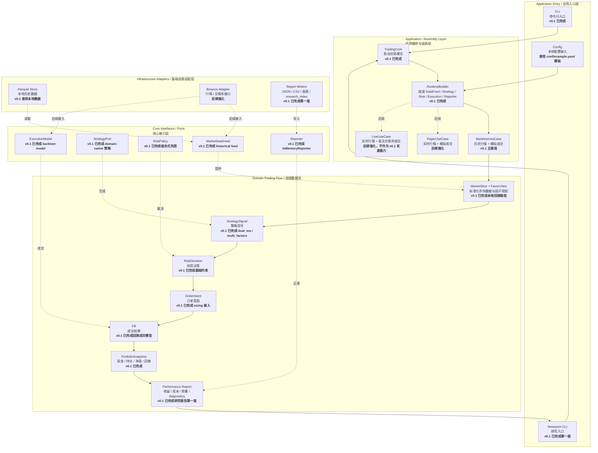

# crypto_trader

这是一个基于策略的加密货币量化交易研究项目。当前已经完成主交易链路的四层解耦和本地回测研究闭环第一版。

## 当前定位

当前项目适合做：

- 本地历史 K 线回测
- domain-native 策略开发
- 参数网格扫描
- walk-forward 窗口研究
- 成本、滑点、换手和持仓行为诊断
- JSON 报告、研究 summary、策略图表输出

当前项目不适合直接做：

- 真实资金实盘交易
- 未验证交易所 API 自动下单
- 高频生产环境执行

虽然代码中保留了 paper/live mode 的运行边界和安全门，但现阶段请把它们视为后续扩展接口，而不是可直接投入资金的实盘系统。

## 核心架构

下面是项目的理想目标架构，以及 v0.1 当前完成状态：


```mermaid
flowchart TB
    subgraph ENTRY["Application Entry / 应用入口层"]
        CLI["CLI<br/>命令行入口<br/><b>v0.1 已完成</b>"]
        RCLI["Research CLI<br/>研究入口<br/><b>v0.1 已完成第一版</b>"]
        CFG["Config<br/>本地配置输入<br/><b>使用 conf/example.yaml 模板</b>"]
    end

    subgraph APP["Application / Assembly Layer<br/>应用编排与组装层"]
        CORE["TradingCore<br/>启动交易模式<br/><b>v0.1 已完成</b>"]
        BUILDER["RuntimeBuilder<br/>组装 DataFeed / Strategy / Risk / Execution / Reporter<br/><b>v0.1 已完成</b>"]
        BT["BacktestUseCase<br/>历史行情 + 模拟成交<br/><b>v0.1 主路径</b>"]
        PT["PaperUseCase<br/>实时行情 + 模拟成交<br/><b>后续强化</b>"]
        LT["LiveUseCase<br/>实时行情 + 真实交易所成交<br/><b>后续强化，不作为 v0.1 实盘能力</b>"]
    end

    subgraph DOMAIN["Domain Trading Flow / 领域数据流"]
        MD["MarketSlice + FactorView<br/>标准化市场数据与因子视图<br/><b>v0.1 已完成本地回测路径</b>"]
        SIG["StrategySignal<br/>策略信号<br/><b>v0.1 已完成 dual_ma / multi_factors</b>"]
        RISK["RiskDecision<br/>风控决策<br/><b>v0.1 已完成基础约束</b>"]
        ORDER["OrderIntent<br/>订单意图<br/><b>v0.1 已完成 sizing 接入</b>"]
        FILL["Fill<br/>成交结果<br/><b>v0.1 已完成回测成交模型</b>"]
        PORT["PortfolioSnapshot<br/>现金 / 持仓 / 净值 / 回撤<br/><b>v0.1 已完成</b>"]
        REPORT["Performance Report<br/>收益 / 成本 / 质量 / diagnostics<br/><b>v0.1 已完成研究报告第一版</b>"]
    end

    subgraph PORTS["Core Interfaces / Ports<br/>核心接口层"]
        DATAFEED["MarketDataFeed<br/><b>v0.1 已完成 historical feed</b>"]
        STRATEGY["StrategyPort<br/><b>v0.1 已完成 domain-native 策略</b>"]
        RISKPOLICY["RiskPolicy<br/><b>v0.1 已完成组合式风控</b>"]
        EXECMODEL["ExecutionModel<br/><b>v0.1 已完成 backtest model</b>"]
        REPORTER["Reporter<br/><b>v0.1 已完成 InMemoryReporter</b>"]
    end

    subgraph INFRA["Infrastructure Adapters / 基础设施适配层"]
        PARQUET["Parquet Store<br/>本地历史数据<br/><b>v0.1 使用本地数据</b>"]
        BINANCE["Binance Adapter<br/>行情 / 交易所接口<br/><b>后续强化</b>"]
        FILES["Report Writers<br/>JSON / CSV / 图表 / research_index<br/><b>v0.1 已完成第一版</b>"]
    end

    CLI --> CORE
    RCLI --> CORE
    CFG --> BUILDER
    CORE --> BUILDER
    BUILDER --> BT
    BUILDER -.后续.-> PT
    BUILDER -.后续.-> LT
    BT --> MD
    MD --> SIG --> RISK --> ORDER --> FILL --> PORT --> REPORT
    REPORT --> RCLI

    DATAFEED -.提供.-> MD
    STRATEGY -.生成.-> SIG
    RISKPOLICY -.裁决.-> RISK
    EXECMODEL -.成交.-> FILL
    REPORTER -.记录.-> REPORT

    PARQUET -.读取.-> DATAFEED
    BINANCE -.后续接入.-> DATAFEED
    BINANCE -.后续接入.-> EXECMODEL
    FILES -.写入.-> REPORTER
```

主链路已经从旧的 DataFrame pipeline 和旧 ExecutionEngine 收敛为 domain pipeline：

```text
CLI / Research CLI
-> TradingCore
-> TradingMode
-> RuntimeBuilder
-> DomainTradingPipeline
-> Strategy / Risk / Order / Execution / Portfolio / Reporter
```

业务层按职责拆分为：

```text
Data + Factor Layer
  读取行情、清洗数据、生成因子视图

Strategy Layer
  只根据 MarketSlice、FactorView、PortfolioSnapshot 生成 StrategySignal

Order + Execution Layer
  完成风控、仓位 sizing、OrderIntent、模拟成交 Fill

Performance + Report Layer
  消费 Fill 和 PortfolioSnapshot，生成绩效、质量、成本和研究诊断报告
```

## 主要能力

### 1. Domain-native 回测主链路

- `DomainTradingPipeline` 串起行情、策略、风控、执行、组合账本和 reporter。
- `PortfolioBook` 是现金、持仓、净值和回撤的事实来源。
- 新策略不需要使用 `pandas.DataFrame` 作为输入输出。
- 策略只输出方向、强度和原因，不直接决定最终下单数量。

### 2. 策略与因子

当前已有 domain-native 策略：

- `dual_ma`
- `multi_factors`

因子层支持：

- MA
- RSI
- MACD
- Bollinger
- Volume Oscillator
- composite signal

### 3. 本地回测研究闭环

Research CLI 支持：

- 参数网格展开
- walk-forward 训练/测试窗口生成
- 批量 backtest runner
- 扫描结果排序
- 嵌套指标排序，例如 `diagnostics.cost_to_abs_net_return`
- summary JSON 输出
- `research_index.json` 研究索引

每个 research run 会记录：

- `run_id`
- `run_hash`
- 参数
- walk-forward window
- `config_hash`
- 脱敏后的 `config_snapshot`
- backtest 报告路径
- 策略图路径
- diagnostics 摘要

敏感配置字段如 `api_key`、`secret`、`password`、`token` 会在研究快照中写为 `<redacted>`。

### 4. 报告与诊断

默认 backtest report 包含：

- 初始资金、最终净值、收益、最大回撤
- 交易记录
- 成本摘要
- 数据质量摘要
- 研究诊断 diagnostics
- 策略图表路径

当前 diagnostics 包括：

- net/gross return estimate
- total transaction cost
- cost drag
- cost to absolute net return
- turnover
- return to drawdown
- open position 检查
- round-trip 次数
- round-trip 胜率
- 平均持仓时间
- 平均 round-trip 收益

## 目录结构

```text
src/
  application/        应用用例、runtime 组装、批量研究入口
  datasource/         数据源、数据 feed、存储和标准化
  domain/             纯领域模型、端口、pipeline、portfolio book
  factor/             因子引擎和 factor view
  order/              仓位 sizing、订单意图、订单工厂
  reporting/          绩效分析、报告 writer、研究 summary、图表和 diagnostics
  strategy/           策略接口、legacy 策略、domain-native 策略
  trading/            backtest/paper/live mode 和执行模型
  ui/                 CLI 和 research CLI
tests/                单元测试和回归测试
docs/                 架构设计、实施计划和 worklist
```

## 安装

建议使用 Python 3.11。

```powershell
python -m venv .venv
.\.venv\Scripts\Activate.ps1
pip install -r requirements.txt
```

首次运行前，复制安全示例配置：

```powershell
Copy-Item conf/example.yaml conf/config.yaml
```

`conf/config.yaml` 是本地运行配置，可能包含个人路径、代理和密钥，默认不建议提交。

## 运行测试

```powershell
$env:PYTHONIOENCODING='utf-8'
$env:PYTHONPATH="$PWD\src;$PWD"
.\.venv\Scripts\python.exe -m unittest discover tests
```

当前完整测试集覆盖 domain pipeline、策略、因子、执行模型、报告、research runner、CLI 和 legacy 删除边界。

## 单次本地回测

本地历史数据默认不随仓库提交。运行真实回测前，需要先准备 `data/historical/` 下的 Parquet K 线数据，或接入自己的数据下载/导入流程。

```powershell
$env:PYTHONIOENCODING='utf-8'
$env:PYTHONPATH="$PWD\src;$PWD"
.\.venv\Scripts\python.exe -m src.main `
  --cli `
  --config conf/config.yaml `
  --mode backtest `
  --strategy dual_ma `
  --symbol "BTC/USDT" `
  --timeframe 1m `
  --start-date 2025-01-01 `
  --end-date 2025-01-02 `
  --backtest-engine ohlcv
```

输出通常位于：

```text
reports/backtest/
reports/final/
```

## Research CLI 示例

PowerShell 调用 JSON 参数时需要保留内部双引号，推荐使用下面这种转义方式：

```powershell
$env:PYTHONIOENCODING='utf-8'
$env:PYTHONPATH="$PWD\src;$PWD"
.\.venv\Scripts\python.exe -m src.main `
  --cli `
  --research `
  --config conf/config.yaml `
  --mode backtest `
  --strategy dual_ma `
  --symbol "BTC/USDT" `
  --timeframe 1m `
  --backtest-engine ohlcv `
  --research-grid '{\"short_window\":[20]}' `
  --research-metric diagnostics.cost_to_abs_net_return `
  --research-ascending `
  --research-walk-forward-start 2024-12-31 `
  --research-walk-forward-end 2025-01-02 `
  --research-train-days 1 `
  --research-test-days 1 `
  --research-step-days 1
```

输出通常位于：

```text
reports/research/research_summary_*.json
reports/research/research_index.json
```

## License

MIT License
