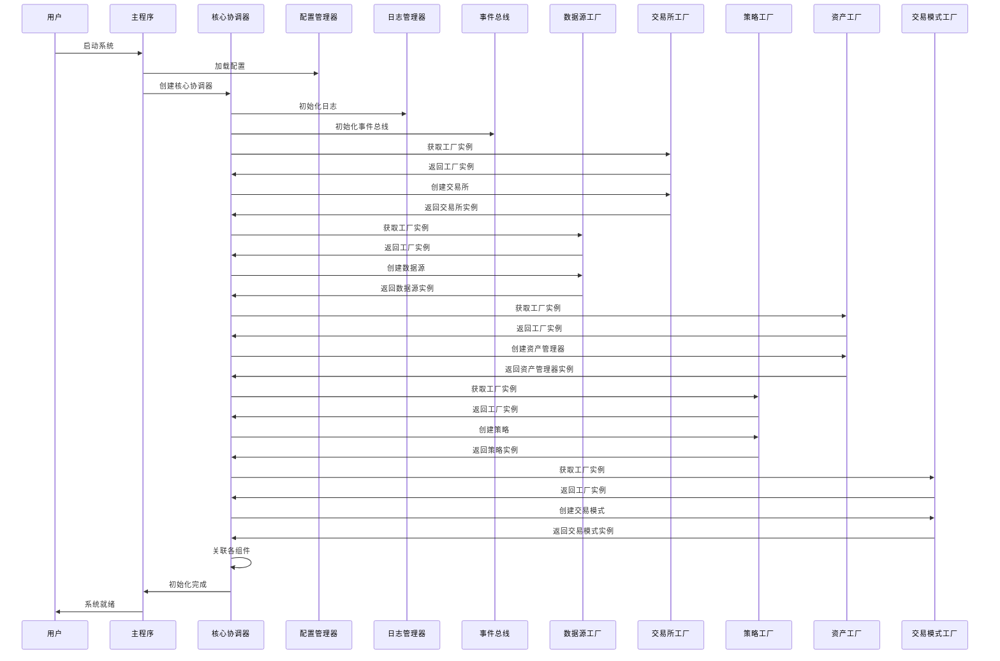
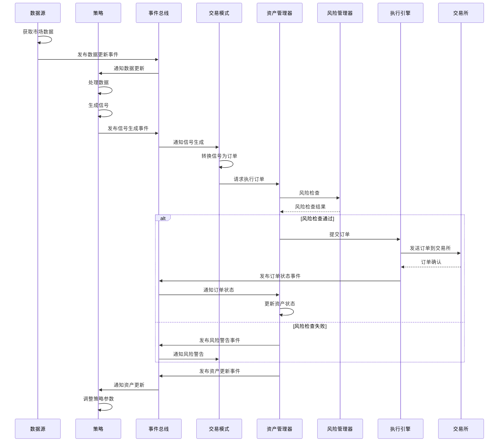
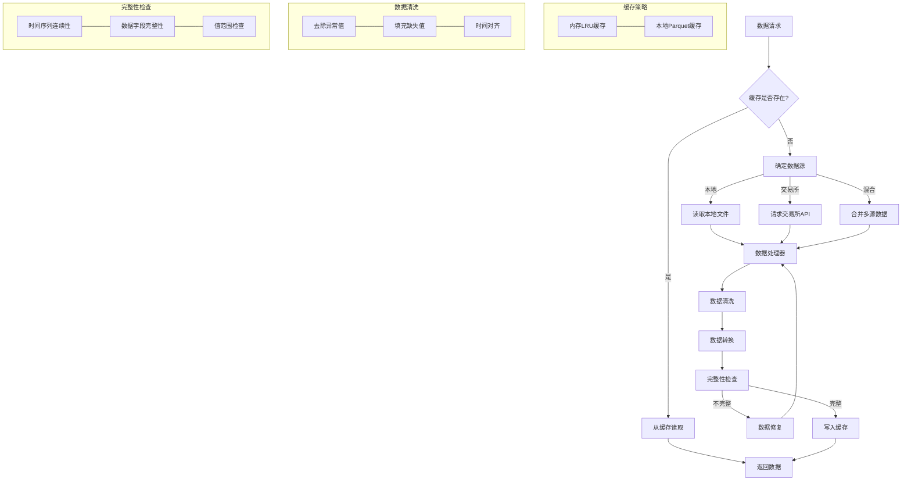
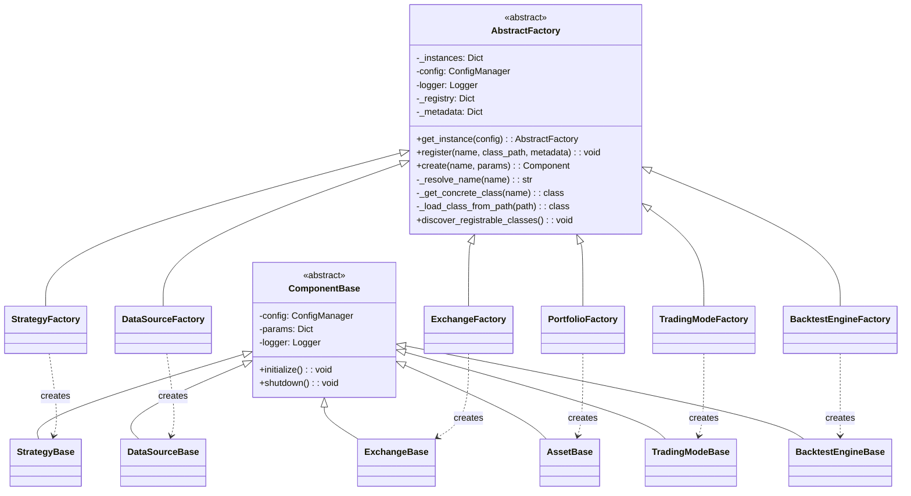
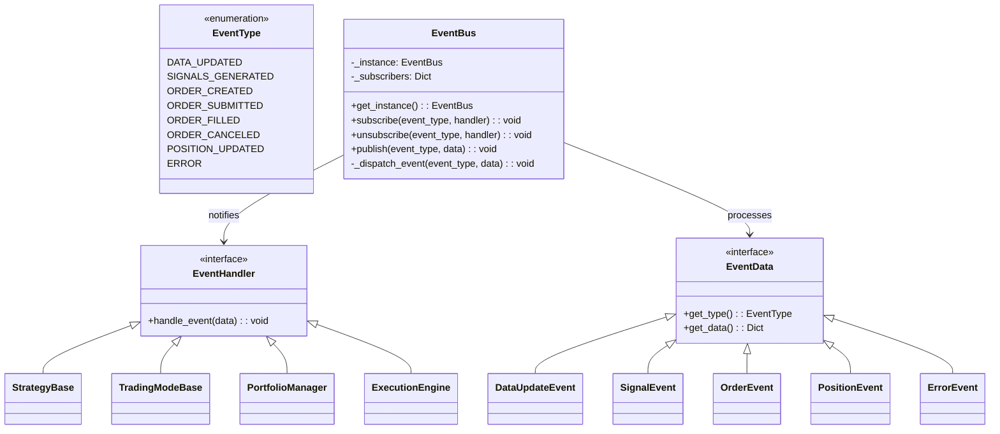
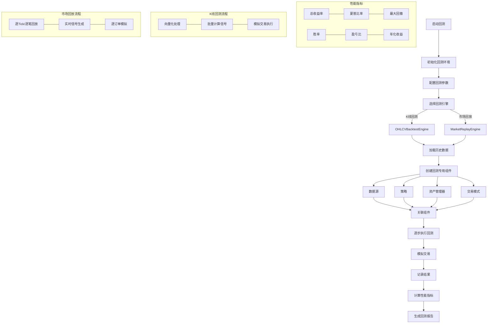

# 量化交易系统架构详细设计

## 1. 系统整体架构

系统采用分层模块化设计，各模块通过事件总线和依赖注入进行交互。以下是系统的整体架构图：

```mermaid

graph TD

    User[用户] --> CLI[命令行界面]

    CLI --> Core[核心协调器]

  

    subgraph 核心层

        Core --> EventBus[事件总线]

        Core --> ConfigManager[配置管理器]

        Core --> LogManager[日志管理器]

    end

  

    subgraph 数据层

        Core --> DataSourceFactory[数据源工厂]

        DataSourceFactory --> LocalDataSource[本地数据源]

        DataSourceFactory --> ExchangeDataSource[交易所数据源]

        DataSourceFactory --> HybridDataSource[混合数据源]

        LocalDataSource --> DataProcessor[数据处理器]

        ExchangeDataSource --> DataProcessor

        HybridDataSource --> DataProcessor

        DataProcessor --> IntegrityChecker[数据完整性检查器]

    end

  

    subgraph 交易所层

        Core --> ExchangeFactory[交易所工厂]

        ExchangeFactory --> BinanceExchange[币安交易所]

        ExchangeFactory --> OtherExchange[其他交易所...]

        BinanceExchange --> ConnectionPool[连接池]

        OtherExchange --> ConnectionPool

    end

  

    subgraph 策略层

        Core --> StrategyFactory[策略工厂]

        StrategyFactory --> DualMAStrategy[双均线策略]

        StrategyFactory --> MultiFactorStrategy[多因子策略]

        StrategyFactory --> NeuralNetworkStrategy[神经网络策略]

        DualMAStrategy --> FactorLib[因子库]

        MultiFactorStrategy --> FactorLib

    end

  

    subgraph 资产层

        Core --> PortfolioFactory[资产工厂]

        PortfolioFactory --> PortfolioManager[资产管理器]

        PortfolioManager --> SpotAsset[现货资产]

        PortfolioManager --> FutureAsset[期货资产]

        PortfolioManager --> OtherAssets[其他资产...]

        PortfolioManager --> RiskManager[风险管理器]

        SpotAsset --> ExecutionEngine[执行引擎]

        FutureAsset --> ExecutionEngine

        OtherAssets --> ExecutionEngine

    end

  

    subgraph 交易层

        Core --> TradingModeFactory[交易模式工厂]

        TradingModeFactory --> LiveMode[实盘模式]

        TradingModeFactory --> PaperMode[模拟模式]

        TradingModeFactory --> BacktestMode[回测模式]

    end

  

    subgraph 回测层

        BacktestMode --> BacktestFactory[回测引擎工厂]

        BacktestFactory --> OHLCVEngine[K线回测引擎]

        BacktestFactory --> MarketReplayEngine[市场回放引擎]

    end

  

    %% 连接事件总线

    EventBus <--> DataProcessor

    EventBus <--> IntegrityChecker

    EventBus <--> ConnectionPool

    EventBus <--> DualMAStrategy

    EventBus <--> MultiFactorStrategy

    EventBus <--> NeuralNetworkStrategy

    EventBus <--> PortfolioManager

    EventBus <--> ExecutionEngine

    EventBus <--> RiskManager

    EventBus <--> LiveMode

    EventBus <--> PaperMode

    EventBus <--> BacktestMode

```



## 2. 组件依赖与初始化流程

系统启动过程采用分阶段初始化，确保各组件按正确顺序创建和关联：



## 3. 信号流转与事件处理

系统中信号处理与交易执行的完整流程如下：



## 4. 数据流处理架构

数据获取、处理和缓存的完整流程：



## 5. 工厂模式与组件创建

工厂模式创建和管理组件的详细流程：



## 6. 详细的事件类型与处理

系统中的事件类型与处理流程：



## 7. 回测引擎详细设计

回测引擎的架构和数据流：



## 8. 优化与扩展机制

系统优化策略与扩展点：

```mermaid

mindmap

  root((量化交易系统))

    性能优化

      内存优化

        __slots__减少内存

        紧凑数据结构

        惰性加载

      计算优化

        向量化计算

        结果缓存

        延迟计算

      I/O优化

        异步I/O

        批量读写

        缓冲写入

      网络优化

        连接池

        请求合并

        压缩传输

    系统扩展

      新资产类型

        继承Asset基类

        实现交易接口

        注册到工厂

      新策略

        继承Strategy基类

        实现信号生成

        注册到工厂

      新交易所

        继承Exchange基类

        实现API接口

        注册到工厂

      新回测引擎

        继承BacktestEngine

        实现模拟逻辑

        注册到工厂

    错误处理

      重试机制

        指数回退

        随机抖动

        最大重试次数

      降级策略

        功能降级

        数据源切换

        限流处理

      状态恢复

        检查点保存

        日志重放

        自动重连

    配置管理

      分层配置

        默认配置

        用户配置

        运行时配置

      配置格式

        YAML格式

        配置继承

        变量替换

```

## 9. 核心模块详细设计

### 9.1 数据源模块详细结构

数据源模块负责获取、处理和管理市场数据，是策略开发和回测的基础。

#### 9.1.1 核心接口定义

```python

classDataSource(ABC):

    """数据源抽象基类"""

  

    def__init__(self, config, params=None):

        self.config = config

        self.params = params or {}

        self.logger = LogManager.get_logger("datasource")

        self.cache = LRUCache(max_size=self.params.get("cache_size", 1000))

        self.event_bus = EventBus.get_instance()

      

    @abstractmethod

    asyncdefinitialize(self):

        """初始化数据源"""

        pass

      

    @abstractmethod

    asyncdefshutdown(self):

        """关闭数据源"""

        pass

      

    asyncdefget_data(self, symbol, timeframe, start_time, end_time):

        """获取数据的统一接口"""

        cache_key = f"{symbol}_{timeframe}_{start_time}_{end_time}"

      

        # 尝试从缓存获取

        cached_data = self.cache.get(cache_key)

        if cached_data isnotNone:

            return cached_data

      

        # 从源获取数据

        data = awaitself._fetch_data(symbol, timeframe, start_time, end_time)

      

        # 处理数据

        processed_data = awaitself._process_data(data)

      

        # 验证数据完整性

        ifnotawaitself._check_integrity(processed_data):

            processed_data = awaitself._repair_data(processed_data)

          

        # 缓存处理后的数据

        self.cache.set(cache_key, processed_data)

      

        # 发布数据更新事件

        awaitself.event_bus.publish("data_updated", {

            "symbol": symbol,

            "timeframe": timeframe,

            "start_time": start_time,

            "end_time": end_time,

            "data_hash": hash(str(processed_data))

        })

      

        return processed_data

      

    @abstractmethod

    asyncdef_fetch_data(self, symbol, timeframe, start_time, end_time):

        """从特定数据源获取数据"""

        pass

      

    asyncdef_process_data(self, data):

        """数据处理"""

        processor = DataProcessor()

        returnawait processor.process(data)

      

    asyncdef_check_integrity(self, data):

        """检查数据完整性"""

        checker = IntegrityChecker()

        returnawait checker.check(data)

      

    asyncdef_repair_data(self, data):

        """修复不完整的数据"""

        repairer = DataRepairer()

        returnawait repairer.repair(data)

      

    asyncdefsubscribe_realtime(self, symbol, timeframe, callback):

        """订阅实时数据"""

        pass

      

    asyncdefunsubscribe_realtime(self, symbol, timeframe):

        """取消订阅实时数据"""

        pass

```

#### 9.1.2 数据源实现

不同类型的数据源实现有各自的特点：

1.**本地数据源**：从本地文件系统读取历史数据，支持多种文件格式（CSV、Parquet等）

2.**交易所数据源**：直接从交易所API获取数据，支持历史数据和实时数据

3.**混合数据源**：组合多种数据源，优先使用高质量数据源，自动切换和合并数据

```python

classLocalDataSource(DataSource):

    """本地数据源实现"""

  

    asyncdef_fetch_data(self, symbol, timeframe, start_time, end_time):

        # 构建文件路径

        path_pattern = self.params.get("path_pattern", "data/{symbol}/{timeframe}/{year}/{month}.parquet")

        path = path_pattern.format(

            symbol=symbol.replace("/", "_"),

            timeframe=timeframe,

            year=start_time.year,

            month=start_time.month

        )

      

        # 检查文件是否存在

        ifnot os.path.exists(path):

            raise DataSourceError(f"Data file not found: {path}")

          

        # 读取数据文件

        try:

            if path.endswith(".parquet"):

                data = pd.read_parquet(path)

            elif path.endswith(".csv"):

                data = pd.read_csv(path, parse_dates=["timestamp"])

            else:

                raise DataSourceError(f"Unsupported file format: {path}")

              

            # 过滤时间范围

            data = data[(data["timestamp"] >= start_time) & (data["timestamp"] <= end_time)]

          

            return data

        exceptExceptionas e:

            raise DataSourceError(f"Failed to read data file: {e}")

```

#### 9.1.3 数据处理器

数据处理器负责清洗、转换和规范化数据：

```python

classDataProcessor:

    """数据处理器"""

  

    asyncdefprocess(self, data):

        """处理数据的主要流程"""

        # 拷贝数据避免修改原始数据

        processed = data.copy()

      

        # 数据类型转换

        processed = self._convert_types(processed)

      

        # 去除重复数据

        processed = self._remove_duplicates(processed)

      

        # 排序数据

        processed = self._sort_data(processed)

      

        # 规范化列名

        processed = self._normalize_columns(processed)

      

        # 填充缺失值

        processed = self._fill_missing_values(processed)

      

        # 移除异常值

        processed = self._remove_outliers(processed)

      

        return processed

      

    def_convert_types(self, data):

        """转换数据类型"""

        if"timestamp"in data.columns andnot pd.api.types.is_datetime64_any_dtype(data["timestamp"]):

            data["timestamp"] = pd.to_datetime(data["timestamp"])

          

        numeric_columns = ["open", "high", "low", "close", "volume"]

        for col in numeric_columns:

            if col in data.columns andnot pd.api.types.is_numeric_dtype(data[col]):

                data[col] = pd.to_numeric(data[col], errors="coerce")

              

        return data

      

    def_remove_duplicates(self, data):

        """去除重复数据"""

        return data.drop_duplicates(subset=["timestamp"])

      

    def_sort_data(self, data):

        """排序数据"""

        return data.sort_values(by=["timestamp"])

      

    def_normalize_columns(self, data):

        """规范化列名"""

        expected_columns = ["timestamp", "open", "high", "low", "close", "volume"]

        rename_map = {}

      

        # 处理常见的列名变体

        column_variants = {

            "timestamp": ["time", "date", "datetime"],

            "open": ["open_price", "opening_price"],

            "high": ["high_price", "highest_price"],

            "low": ["low_price", "lowest_price"],

            "close": ["close_price", "closing_price"],

            "volume": ["vol", "volume_traded"]

        }

      

        for standard, variants in column_variants.items():

            for variant in variants:

                if variant in data.columns and standard notin data.columns:

                    rename_map[variant] = standard

                  

        if rename_map:

            data = data.rename(columns=rename_map)

          

        # 确保所有必要的列都存在

        for col in expected_columns:

            if col notin data.columns:

                if col == "volume":

                    data[col] = 0  # 默认成交量为0

                else:

                    raise DataProcessingError(f"Required column missing: {col}")

                  

        return data

      

    def_fill_missing_values(self, data):

        """填充缺失值"""

        # 对于价格数据，使用前向填充

        price_columns = ["open", "high", "low", "close"]

        data[price_columns] = data[price_columns].fillna(method="ffill")

      

        # 对于成交量，使用0填充

        if"volume"in data.columns:

            data["volume"] = data["volume"].fillna(0)

          

        return data

      

    def_remove_outliers(self, data):

        """移除异常值"""

        # 使用简单的IQR方法检测异常值

        for col in ["open", "high", "low", "close"]:

            if col in data.columns:

                q1 = data[col].quantile(0.25)

                q3 = data[col].quantile(0.75)

                iqr = q3 - q1

                lower_bound = q1 - 3 * iqr

                upper_bound = q3 + 3 * iqr

              

                # 异常值替换为边界值而非删除

                data.loc[data[col] < lower_bound, col] = lower_bound

                data.loc[data[col] > upper_bound, col] = upper_bound

              

        return data

```

### 9.2 策略模块详细设计

策略模块负责处理市场数据、生成交易信号，是交易系统的核心决策部分。

#### 9.2.1 策略基类

```python

classStrategy(ABC):

    """策略抽象基类"""

  

    def__init__(self, config, params=None):

        self.config = config

        self.params = params or {}

        self.logger = LogManager.get_logger("strategy")

        self.data_source = None

        self.event_bus = EventBus.get_instance()

        self.state = {}

      

    asyncdefinitialize(self):

        """初始化策略"""

        # 订阅相关事件

        self.event_bus.subscribe("data_updated", self._on_data_updated)

        self.event_bus.subscribe("order_filled", self._on_order_filled)

        self.event_bus.subscribe("position_updated", self._on_position_updated)

      

        # 加载策略状态

        awaitself._load_state()

      

    asyncdefshutdown(self):

        """关闭策略"""

        # 保存策略状态

        awaitself._save_state()

      

        # 取消事件订阅

        self.event_bus.unsubscribe("data_updated", self._on_data_updated)

        self.event_bus.unsubscribe("order_filled", self._on_order_filled)

        self.event_bus.unsubscribe("position_updated", self._on_position_updated)

      

    defset_data_source(self, data_source):

        """设置数据源"""

        self.data_source = data_source

      

    asyncdefprocess_data(self, symbol, timeframe, start_time, end_time):

        """处理数据并生成信号"""

        # 验证参数

        ifnotself.data_source:

            raise StrategyError("Data source not set")

          

        # 获取数据

        data = awaitself.data_source.get_data(symbol, timeframe, start_time, end_time)

      

        # 生成信号

        signals = awaitself.generate_signals(symbol, data)

      

        # 发布信号事件

        for signal in signals:

            awaitself.event_bus.publish("signals_generated", signal)

          

        return signals

      

    @abstractmethod

    asyncdefgenerate_signals(self, symbol, data):

        """生成交易信号，子类必须实现"""

        pass

      

    asyncdef_on_data_updated(self, event_data):

        """数据更新事件处理"""

        pass

      

    asyncdef_on_order_filled(self, event_data):

        """订单成交事件处理"""

        pass

      

    asyncdef_on_position_updated(self, event_data):

        """仓位更新事件处理"""

        pass

      

    asyncdef_load_state(self):

        """加载策略状态"""

        state_file = f"states/strategy_{self.__class__.__name__}.json"

        if os.path.exists(state_file):

            try:

                withopen(state_file, 'r') as f:

                    self.state = json.load(f)

            exceptExceptionas e:

                self.logger.error(f"Failed to load strategy state: {e}")

              

    asyncdef_save_state(self):

        """保存策略状态"""

        state_file = f"states/strategy_{self.__class__.__name__}.json"

        try:

            os.makedirs(os.path.dirname(state_file), exist_ok=True)

            withopen(state_file, 'w') as f:

                json.dump(self.state, f)

        exceptExceptionas e:

            self.logger.error(f"Failed to save strategy state: {e}")

```

#### 9.2.2 策略实现示例

以双均线策略为例：

```python

classDualMAStrategy(Strategy):

    """双均线交叉策略"""

  

    asyncdefinitialize(self):

        """初始化策略"""

        awaitsuper().initialize()

      

        # 设置默认参数

        self.fast_period = self.params.get("fast_period", 5)

        self.slow_period = self.params.get("slow_period", 20)

        self.logger.info(f"Initialized DualMA strategy with fast_period={self.fast_period}, slow_period={self.slow_period}")

      

    asyncdefgenerate_signals(self, symbol, data):

        """生成交易信号"""

        # 计算快速和慢速移动平均线

        data = data.copy()

        data['fast_ma'] = data['close'].rolling(window=self.fast_period).mean()

        data['slow_ma'] = data['close'].rolling(window=self.slow_period).mean()

      

        # 计算移动平均线交叉

        data['cross_above'] = (data['fast_ma'] > data['slow_ma']) & (data['fast_ma'].shift(1) <= data['slow_ma'].shift(1))

        data['cross_below'] = (data['fast_ma'] < data['slow_ma']) & (data['fast_ma'].shift(1) >= data['slow_ma'].shift(1))

      

        # 生成信号

        signals = []

      

        for idx, row in data.iterrows():

            if row['cross_above']:

                signals.append({

                    'timestamp': row['timestamp'],

                    'symbol': symbol,

                    'action': 'buy',

                    'quantity': 1.0,  # 标准化数量，后续由资产管理器调整

                    'price': row['close'],

                    'reason': 'fast_ma_crossed_above_slow_ma'

                })

            elif row['cross_below']:

                signals.append({

                    'timestamp': row['timestamp'],

                    'symbol': symbol,

                    'action': 'sell',

                    'quantity': 1.0,  # 标准化数量，后续由资产管理器调整

                    'price': row['close'],

                    'reason': 'fast_ma_crossed_below_slow_ma'

                })

              

        self.logger.info(f"Generated {len(signals)} signals for {symbol}")

        return signals

```

#### 9.2.3 因子库设计

多因子策略的基础设施，提供常用技术指标和因子计算：

```python

classFactorLib:

    """因子计算库"""

  

    @staticmethod

    defsma(data, period):

        """简单移动平均线"""

        return data.rolling(window=period).mean()

      

    @staticmethod

    defema(data, period):

        """指数移动平均线"""

        return data.ewm(span=period, adjust=False).mean()

      

    @staticmethod

    defrsi(data, period):

        """相对强弱指标"""

        delta = data.diff()

        gain = delta.where(delta > 0, 0)

        loss = -delta.where(delta < 0, 0)

      

        avg_gain = gain.rolling(window=period).mean()

        avg_loss = loss.rolling(window=period).mean()

      

        rs = avg_gain / avg_loss

        return100 - (100 / (1 + rs))

      

    @staticmethod

    defbollinger_bands(data, period=20, std_dev=2):

        """布林带"""

        middle = data.rolling(window=period).mean()

        std = data.rolling(window=period).std()

      

        upper = middle + std_dev * std

        lower = middle - std_dev * std

      

        return {

            'upper': upper,

            'middle': middle,

            'lower': lower

        }

      

    @staticmethod

    defmacd(data, fast_period=12, slow_period=26, signal_period=9):

        """MACD指标"""

        fast_ema = data.ewm(span=fast_period, adjust=False).mean()

        slow_ema = data.ewm(span=slow_period, adjust=False).mean()

      

        macd_line = fast_ema - slow_ema

        signal_line = macd_line.ewm(span=signal_period, adjust=False).mean()

        histogram = macd_line - signal_line

      

        return {

            'macd': macd_line,

            'signal': signal_line,

            'histogram': histogram

        }

      

    @staticmethod

    defatr(data, period=14):

        """平均真实范围"""

        high = data['high']

        low = data['low']

        close = data['close']

      

        tr1 = high - low

        tr2 = abs(high - close.shift(1))

        tr3 = abs(low - close.shift(1))

      

        tr = pd.DataFrame({

            'tr1': tr1,

            'tr2': tr2,

            'tr3': tr3

        }).max(axis=1)

      

        return tr.rolling(window=period).mean()

```

### 9.3 资产模块详细设计

资产模块负责管理交易资产、执行订单和控制风险，是连接策略和交易所的桥梁。

#### 9.3.1 资产基类

```python

classAsset(ABC):

    """资产抽象基类"""

  

    def__init__(self, name, exchange=None, config=None, params=None):

        self.name = name

        self.exchange = exchange

        self.config = config or ConfigManager()

        self.params = params or {}

        self.logger = LogManager.get_logger(f"asset.{name}")

      

        # 资产状态

        self._value = Decimal('0')

        self._position = Decimal('0')

        self._cost_basis = Decimal('0')

        self._unrealized_pnl = Decimal('0')

        self._realized_pnl = Decimal('0')

      

        # 交易功能（可选）

        self.is_tradable = params.get('tradable', False)

        ifself.is_tradable:

            self._setup_trading()

  

    def_setup_trading(self):

        """设置交易组件"""

        # 初始化交易组件

        self.orders = {}

        self.execution_engine = ExecutionEngine(self.config)

        self.event_bus = EventBus.get_instance()

      

        # 订阅订单事件

        self.event_bus.subscribe('order_filled', self._on_order_filled)

        self.event_bus.subscribe('order_canceled', self._on_order_canceled)

  

    asyncdefinitialize(self):

        """初始化资产"""

        try:

            # 如果有交易所，获取初始余额

            ifself.exchange andself.is_tradable:

                balance = awaitself.exchange.get_balance(self.name)

                self._position = Decimal(str(balance['free']))

                self._value = self._position

              

            self.logger.info(f"Initialized {self.name} asset with position {self._position}")

          

            # 发布资产初始化事件

            awaitself.event_bus.publish('asset_initialized', {

                'asset': self.name,

                'position': float(self._position),

                'value': float(self._value)

            })

          

        exceptExceptionas e:

            self.logger.error(f"Failed to initialize {self.name} asset: {e}")

            raise

  

    asyncdefshutdown(self):

        """关闭资产"""

        ifself.is_tradable:

            # 取消所有未完成的订单

            for order_id inlist(self.orders.keys()):

                awaitself.cancel_order(order_id)

              

            # 取消事件订阅

            self.event_bus.unsubscribe('order_filled', self._on_order_filled)

            self.event_bus.unsubscribe('order_canceled', self._on_order_canceled)

          

        self.logger.info(f"Shutdown {self.name} asset")

  

    asyncdef_on_order_filled(self, order_data):

        """处理订单成交事件"""

        if order_data.get('asset') == self.name:

            order_id = order_data.get('order_id')

            if order_id inself.orders:

                order = self.orders[order_id]

              

                # 更新订单状态

                old_status = order['status']

                order['status'] = order_data.get('status', old_status)

                order['filled_quantity'] = order_data.get('filled_quantity', order.get('filled_quantity', 0))

                order['avg_filled_price'] = order_data.get('avg_filled_price', order.get('avg_filled_price', 0))

              

                # 更新资产仓位

                filled_qty = Decimal(str(order_data.get('filled_quantity', 0)))

                fill_price = Decimal(str(order_data.get('avg_filled_price', 0)))

              

                if order['direction'] == 'buy':

                    self._position += filled_qty

                    self._cost_basis += filled_qty * fill_price

                elif order['direction'] == 'sell':

                    realized_pnl = (fill_price - self._cost_basis / self._position) * filled_qty ifself._position > 0else Decimal('0')

                    self._position -= filled_qty

                    self._realized_pnl += realized_pnl

                  

                    # 更新成本基础

                    ifself._position > 0:

                        # 保持平均成本

                        self._cost_basis = self._cost_basis * (self._position / (self._position + filled_qty))

                    else:

                        self._cost_basis = Decimal('0')

              

                # 更新资产价值

                awaitself.update_value()

              

                # 如果订单已完全成交，移除订单

                if order['status'] == 'filled':

                    delself.orders[order_id]

                  

                # 发布资产更新事件

                awaitself.event_bus.publish('position_updated', {

                    'asset': self.name,

                    'position': float(self._position),

                    'value': float(self._value),

                    'realized_pnl': float(self._realized_pnl),

                    'unrealized_pnl': float(self._unrealized_pnl)

                })

  

    asyncdef_on_order_canceled(self, order_data):

        """处理订单取消事件"""

        if order_data.get('asset') == self.name:

            order_id = order_data.get('order_id')

            if order_id inself.orders:

                delself.orders[order_id]

  

    asyncdefget_value(self):

        """获取资产当前价值"""

        returnfloat(self._value)

  

    asyncdefupdate_value(self):

        """更新资产价值"""

        ifself.exchange andself._position > 0:

            try:

                # 获取当前市场价格

                ticker = awaitself.exchange.get_ticker(self.name)

                current_price = Decimal(str(ticker['last']))

              

                # 计算未实现盈亏

                ifself._cost_basis > 0:

                    self._unrealized_pnl = (current_price - self._cost_basis / self._position) * self._position

              

                # 更新总价值

                self._value = self._position * current_price

              

            exceptExceptionas e:

                self.logger.error(f"Failed to update {self.name} value: {e}")

      

        returnfloat(self._value)

  

    asyncdefbuy(self, quantity, price=None, order_type='market', **kwargs):

        """买入资产"""

        ifnotself.is_tradable:

            raiseValueError(f"Asset {self.name} is not tradable")

          

        # 创建订单

        order = {

            'order_id': str(uuid.uuid4()),

            'symbol': self.name,

            'direction': 'buy',

            'quantity': quantity,

            'price': price,

            'type': order_type,

            'status': 'created',

            'timestamp': datetime.now(),

            'filled_quantity': 0,

            'avg_filled_price': 0,

            'asset': self.name,

            'params': kwargs

        }

      

        # 保存订单

        self.orders[order['order_id']] = order

      

        # 发布订单创建事件

        awaitself.event_bus.publish('order_created', order)

      

        # 执行订单

        ifself.exchange:

            try:

                result = awaitself.execution_engine.execute_order(self.exchange, order)

                order.update(result)

              

                # 发布订单提交事件

                awaitself.event_bus.publish('order_submitted', order)

              

            exceptExceptionas e:

                order['status'] = 'failed'

                order['error'] = str(e)

                self.logger.error(f"Failed to execute buy order: {e}")

              

                # 发布订单错误事件

                awaitself.event_bus.publish('order_error', order)

              

        return order

  

    asyncdefsell(self, quantity, price=None, order_type='market', **kwargs):

        """卖出资产"""

        ifnotself.is_tradable:

            raiseValueError(f"Asset {self.name} is not tradable")

          

        # 检查是否有足够的资产可卖

        ifself._position < Decimal(str(quantity)):

            raiseValueError(f"Insufficient position: have {self._position}, want to sell {quantity}")

          

        # 创建订单

        order = {

            'order_id': str(uuid.uuid4()),

            'symbol': self.name,

            'direction': 'sell',

            'quantity': quantity,

            'price': price,

            'type': order_type,

            'status': 'created',

            'timestamp': datetime.now(),

            'filled_quantity': 0,

            'avg_filled_price': 0,

            'asset': self.name,

            'params': kwargs

        }

      

        # 保存订单

        self.orders[order['order_id']] = order

      

        # 发布订单创建事件

        awaitself.event_bus.publish('order_created', order)

      

        # 执行订单

        ifself.exchange:

            try:

                result = awaitself.execution_engine.execute_order(self.exchange, order)

                order.update(result)

              

                # 发布订单提交事件

                awaitself.event_bus.publish('order_submitted', order)

              

            exceptExceptionas e:

                order['status'] = 'failed'

                order['error'] = str(e)

                self.logger.error(f"Failed to execute sell order: {e}")

              

                # 发布订单错误事件

                awaitself.event_bus.publish('order_error', order)

              

        return order

  

    asyncdefcancel_order(self, order_id):

        """取消订单"""

        ifnotself.is_tradable:

            raiseValueError(f"Asset {self.name} is not tradable")

          

        if order_id notinself.orders:

            raiseValueError(f"Order {order_id} not found")

          

        order = self.orders[order_id]

      

        if order['status'] in ('filled', 'canceled'):

            return order

          

        # 取消订单

        ifself.exchange:

            try:

                result = awaitself.execution_engine.cancel_order(self.exchange, order)

                order.update(result)

                order['status'] = 'canceled'

              

                # 发布订单取消事件

                awaitself.event_bus.publish('order_canceled', order)

              

            exceptExceptionas e:

                self.logger.error(f"Failed to cancel order: {e}")

                raise

              

        return order

  

    asyncdefget_position(self):

        """获取当前仓位"""

        returnfloat(self._position)

  

    asyncdefget_pnl(self):

        """获取盈亏情况"""

        return {

            'realized': float(self._realized_pnl),

            'unrealized': float(self._unrealized_pnl),

            'total': float(self._realized_pnl + self._unrealized_pnl)

        }

```

## 10. 配置和日志管理

### 10.1 配置管理

系统提供灵活的多层次配置管理：

```python

classConfigManager:

    """配置管理器"""

  

    def__init__(self, config_path=None):

        self.logger = LogManager.get_logger("config")

      

        # 加载默认配置

        self.default_config = self._load_config("config/default.yaml")

      

        # 加载用户配置

        self.user_config = {}

        if config_path:

            self.user_config = self._load_config(config_path)

          

        # 运行时配置

        self.runtime_config = {}

      

        self.logger.info(f"Initialized ConfigManager with {config_path}")

      

    def_load_config(self, path):

        """加载配置文件"""

        ifnot os.path.exists(path):

            self.logger.warning(f"Config file not found: {path}")

            return {}

          

        try:

            withopen(path, 'r') as f:

                config = yaml.safe_load(f)

                return config or {}

        exceptExceptionas e:

            self.logger.error(f"Failed to load config file {path}: {e}")

            return {}

          

    defget(self, *keys, default=None, cast=None):

        """获取配置值"""

        # 逐层访问配置

        value = None

      

        # 先查找运行时配置

        temp = self.runtime_config

        for key in keys:

            if key in temp:

                temp = temp[key]

            else:

                temp = None

                break

        if temp isnotNone:

            value = temp

          

        # 如果没找到，查找用户配置

        if value isNone:

            temp = self.user_config

            for key in keys:

                ifisinstance(temp, dict) and key in temp:

                    temp = temp[key]

                else:

                    temp = None

                    break

            if temp isnotNone:

                value = temp

              

        # 如果还没找到，查找默认配置

        if value isNone:

            temp = self.default_config

            for key in keys:

                ifisinstance(temp, dict) and key in temp:

                    temp = temp[key]

                else:

                    temp = None

                    break

            if temp isnotNone:

                value = temp

              

        # 如果最终没找到，使用默认值

        if value isNone:

            value = default

          

        # 类型转换

        if cast and value isnotNone:

            try:

                value = cast(value)

            exceptExceptionas e:

                self.logger.error(f"Failed to cast config value: {e}")

                return default

              

        return value

      

    defset(self, value, *keys):

        """设置运行时配置值"""

        ifnot keys:

            return

          

        # 创建嵌套字典结构

        current = self.runtime_config

        for key in keys[:-1]:

            if key notin current:

                current[key] = {}

            current = current[key]

          

        # 设置最终值

        current[keys[-1]] = value

```

### 10.2 日志管理

优化的日志管理系统支持分级记录和异步写入：

```python

classLogManager:

    """日志管理器"""

  

    _loggers = {}

    _initialized = False

  

    @classmethod

    definitialize(cls, config):

        """初始化日志系统"""

        ifcls._initialized:

            return

          

        # 获取日志配置

        log_config = config.get("logging", default={})

        base_path = log_config.get("base_path", "./logs")

        log_level = log_config.get("level", "INFO")

      

        # 创建日志目录

        os.makedirs(base_path, exist_ok=True)

      

        # 配置根日志器

        root_logger = logging.getLogger()

        root_logger.setLevel(getattr(logging, log_level))

      

        # 清除现有处理器

        for handler in root_logger.handlers[:]:

            root_logger.removeHandler(handler)

          

        # 添加控制台处理器

        console_handler = logging.StreamHandler()

        console_handler.setLevel(getattr(logging, log_config.get("console_level", log_level)))

      

        # 设置格式化器

        formatter = logging.Formatter(

            log_config.get("format", '%(asctime)s | %(levelname)s | %(name)-15s | %(message)s'),

            log_config.get("date_format", '%Y-%m-%d %H:%M:%S')

        )

        console_handler.setFormatter(formatter)

        root_logger.addHandler(console_handler)

      

        # 添加文件处理器

        log_file = os.path.join(base_path, "system.log")

        if log_config.get("file_enabled", True):

            # 创建旋转文件处理器

            file_handler = RotatingFileHandler(

                log_file,

                maxBytes=log_config.get("max_size", 10485760),  # 默认10MB

                backupCount=log_config.get("backup_count", 5)

            )

            file_handler.setLevel(getattr(logging, log_config.get("file_level", log_level)))

            file_handler.setFormatter(formatter)

            root_logger.addHandler(file_handler)

          

        cls._initialized = True

      

        # 创建系统日志器

        system_logger = cls.get_logger("system")

        system_logger.info("Log system initialized")

      

    @classmethod

    defget_logger(cls, name):

        """获取或创建日志器"""

        if name incls._loggers:

            returncls._loggers[name]

          

        # 确保日志系统已初始化

        ifnotcls._initialized:

            # 使用临时配置初始化

            temp_config = ConfigManager()

            cls.initialize(temp_config)

          

        # 创建日志器

        logger = logging.getLogger(name)

        cls._loggers[name] = logger

      

        return logger

```

## 11. 实战示例：创建和运行策略

以下是创建和运行双均线策略的完整示例：

```python

asyncdefrun_strategy():

    """运行双均线策略示例"""

    # 加载配置

    config = ConfigManager("config/user.yaml")

  

    # 初始化日志

    LogManager.initialize(config)

    logger = LogManager.get_logger("example")

  

    # 创建核心组件

    core = Core(config)

    await core.initialize()

  

    # 创建策略

    strategy_factory = StrategyFactory.get_instance(config)

    strategy = await strategy_factory.create("dual_ma", {

        "fast_period": 5,

        "slow_period": 20

    })

  

    # 创建数据源

    data_factory = DataSourceFactory.get_instance(config)

    data_source = await data_factory.create("exchange")

  

    # 关联组件

    strategy.set_data_source(data_source)

  

    # 创建交易模式

    trading_factory = TradingModeFactory.get_instance(config)

    trading_mode = await trading_factory.create("paper")

  

    # 创建资产组合

    portfolio_factory = PortfolioFactory.get_instance(config)

    portfolio = await portfolio_factory.create()

  

    # 添加资产

    exchange_factory = ExchangeFactory.get_instance(config)

    exchange = await exchange_factory.create("binance")

  

    btc_asset = await asset_factory.create("spot", {

        "name": "BTC/USDT",

        "exchange": exchange,

        "tradable": True

    })

  

    await portfolio.add_asset(btc_asset)

  

    # 关联策略和资产

    trading_mode.set_strategy(strategy)

    trading_mode.set_portfolio(portfolio)

  

    # 运行策略

    try:

        logger.info("Starting strategy...")

      

        # 获取当前时间

        now = datetime.now()

        start_time = now - timedelta(days=30)  # 30天前的数据

      

        # 处理历史数据

        symbol = "BTC/USDT"

        timeframe = "1h"

        signals = await strategy.process_data(symbol, timeframe, start_time, now)

      

        logger.info(f"Generated {len(signals)} signals")

      

        # 等待新的市场数据和交易

        await asyncio.sleep(3600)  # 运行1小时

      

    exceptExceptionas e:

        logger.error(f"Error running strategy: {e}")

      

    finally:

        # 关闭组件

        await portfolio.shutdown()

        await strategy.shutdown()

        await data_source.shutdown()

        await exchange.shutdown()

```

## 12. 总结

本文档详细描述了一个轻量级、高性能的量化交易系统架构。系统采用异步事件驱动模型和工厂模式，实现了模块化设计和灵活的扩展机制。主要特点包括：

- 分层架构，清晰的组件边界和职责划分
- 事件驱动的组件通信，实现松耦合交互
- 统一的工厂模式，简化组件创建和管理
- 多层次配置管理，支持灵活的系统配置
- 完善的错误处理和恢复机制，提高系统稳定性
- 内存和计算优化，适合单线程环境运行
- 支持多种资产类型、策略和交易所

该系统架构非常适合个人量化交易项目，可以在有限的服务器资源下高效运行，并支持从策略开发、回测到实盘交易的完整流程。通过明确的扩展接口，用户可以方便地添加新的策略、资产类型和交易所连接。
