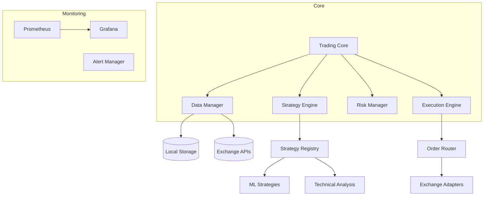

# Crypto Quantitative Trading System


[](https://github.com/psf/black)
[](https://github.com/your-org/crypto-trading-system/wiki)

## 🚀 Overview

A modular, high-performance quantitative trading platform for cryptocurrency markets, supporting multi-mode trading workflows from backtesting to live execution.

## 🌟 Key Features

### Core Capabilities
- **Multi-Mode Trading**: Backtest, Paper Trading, Live Trading
- **Strategy Development Framework**: Dynamic strategy loading
- **Risk Management Suite**: Real-time position monitoring
- **Data Fusion Engine**: Unified interface for 10+ exchanges
- **Performance Analytics**: Interactive dashboards

### Technical Highlights
- Asynchronous event-driven architecture
- Containerized microservices
- GPU-accelerated ML strategies
- Zero-downtime hot reload
- Distributed fault tolerance

---

## 🛠 Quick Start

### Prerequisites
- Python 3.8+
- Redis 6.2+ (caching)
- PostgreSQL 13+ (recommended for production)

### Installation
```bash
# Clone repository
git clone --recurse-submodules https://github.com/your-org/crypto-trading-system.git
cd crypto-trading-system

# Create virtual environment
python -m venv .venv
source .venv/bin/activate  # Linux/macOS
.venv\Scripts\activate     # Windows

# Install dependencies
pip install -r requirements-dev.txt

# Initialize configuration
cp configs/template/config.prod.yaml configs/local/
```

### First Run
```bash
# Start backtest mode
python -m src.launcher --mode=backtest --strategy=DualMA

# Start live trading (Binance example)
python -m src.launcher --mode=live --exchange=binance
```

---

## 🏗 Architecture



---

## 📦 Core Components

| Component               | Description                                  |
|-------------------------|----------------------------------------------|
| **Launcher**            | System bootstrap & configuration loader     |
| **Data Manager**        | Unified interface for 15+ data sources      |
| **Strategy Engine**     | Supports Python/ONNX/TensorFlow strategies   |
| **Risk Manager**        | Real-time position monitoring & circuit breakers |
| **Execution Engine**    | Smart order routing with TWAP/VWAP support   |
| **Performance Monitor** | Interactive HTML reports & PDF exports       |

---

## ⚙️ Configuration

### Sample Config (YAML)
```yaml
exchange:
  name: binance_futures
  api_key: ENC(AES256_ENCRYPTED_KEY)
  symbols: 
    - BTC/USDT:PERP
    - ETH/USDT:PERP

strategy:
  name: LSTM_Predictor
  params:
    lookback_window: 60
    hidden_units: 128

risk:
  max_drawdown: 0.15
  daily_loss_limit: 0.05
  position_sizing: kelly
```

### Environment Variables
```bash
# Database configuration
export PG_HOST=cluster.pg.quant.com
export PG_PASSWORD=securepass123
```

---

## 🔍 Usage Examples

### Backtesting Workflow
```python
from src.backtest import BacktestRunner

runner = BacktestRunner(
    strategy='ArbitrageBot',
    start='2023-01-01',
    end='2023-06-30',
    assets=['BTC/USDT', 'ETH/USDT']
)
results = runner.execute()
results.generate_report('backtest_2023.html')
```

### Live Trading Monitor
```bash
# View real-time metrics
python -m src.tools.monitor --dashboard
```

---

## 🧪 Testing & CI/CD

### Run Test Suite
```bash
pytest tests/ --cov=src --cov-report=html
```

### CI Pipeline
```yaml
# .github/workflows/build.yml
jobs:
  test:
    runs-on: ubuntu-latest
    steps:
      - uses: actions/checkout@v3
      - name: Set up Python
        uses: actions/setup-python@v4
        with:
          python-version: '3.10'
      - run: pip install -r requirements-dev.txt
      - run: pytest tests/ --cov=src
```

---

## 📂 Project Structure

```
.
├── configs/               # Configuration templates
├── data/                  # Market data storage
├── docs/                  # Technical documentation
├── notebooks/             # Jupyter analysis
├── scripts/               # Deployment scripts
├── src/                   # Source code
│   ├── core/              # System core components
│   ├── exchange/          # Exchange adapters
│   ├── ml/                # Machine learning modules
│   └── web/               # Monitoring dashboard
├── tests/                 # Unit/integration tests
└── tools/                 # Developer utilities
```

---

## 🤝 Contributing

1. Fork the repository
2. Create feature branch: `git checkout -b feat/your-feature`
3. Commit changes: `git commit -m "feat: add new feature"`
4. Push to branch: `git push origin feat/your-feature`
5. Open pull request

### Development Standards
- 100% type hint coverage
- Google-style docstrings
- Black-formatted code
- 90%+ test coverage

---

## ⚠️ Disclaimer

**Cryptocurrency trading involves substantial risk.**  
This system is provided for educational/research purposes only. Past performance does not guarantee future results. Always:  
- Test strategies thoroughly in simulation  
- Use proper risk management  
- Never trade with unaffordable capital  

---

## 📞 Contact

- **Security Issues**: security@quant-system.com  
- **Community Support**: [Discord Server](https://discord.gg/quant-trading)  
- **Commercial Inquiries**: partners@quant-system.com  

> **Legal Notice**：This system follows the MIT open source protocol, and users should bear the transaction risk. It is recommended to conduct a comprehensive security audit before deployment in a production environment.
>
