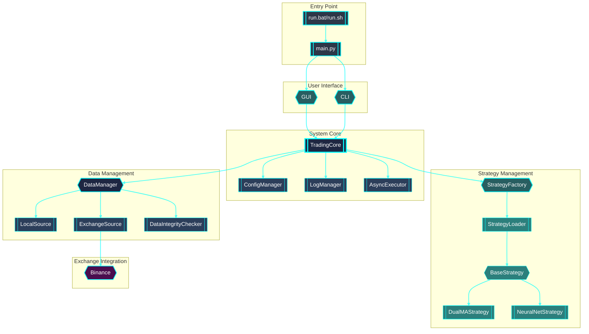
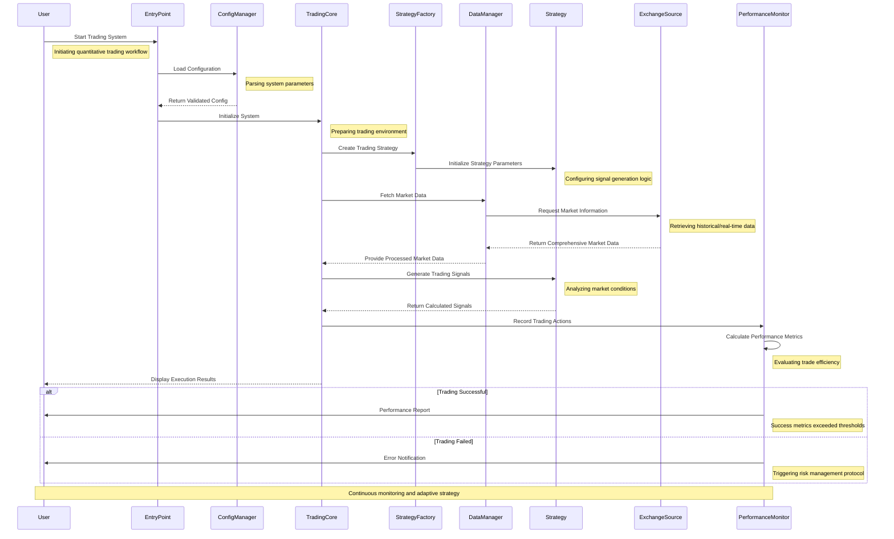

# Quantitative Trading System Architecture

## System Design Philosophy

The trading system is designed with a focus on:

- Modularity
- Extensibility
- Performance
- Risk Management

## Architectural Overview

### Component Interaction Diagram



### Workflow Sequence Diagram



## Detailed Component Design

### 1. Launcher

- **Responsibility**: System entry point
- **Key Functions**:
  - Parse command-line arguments
  - Load system configuration
  - Initialize trading mode
- **Technologies**:
  - Python's `argparse`
  - YAML configuration parsing

### 2. Trading Mode Factory

- **Design Pattern**: Factory Method
- **Supported Modes**:
  - Backtest
  - Paper Trading
  - Live Trading
- **Key Characteristics**:
  - Dynamic mode creation
  - Consistent interface across modes
  - Dependency injection

### 3. Data Manager

- **Core Responsibilities**:
  - Data source abstraction
  - Data acquisition
  - Data preprocessing
- **Supported Sources**:
  - Local historical data
  - Exchange real-time data
- **Features**:
  - Caching mechanism
  - Data integrity checking
  - Multi-source support

### 4. Strategy Engine

- **Architecture**:
  - Base strategy abstract class
  - Strategy factory
  - Dynamic strategy loading
- **Current Strategies**:
  - Dual Moving Average (DualMA)
  - Neural Network (Placeholder)
- **Extensibility**:
  - Easy to add new strategies
  - Consistent signal generation interface

### 5. Risk Manager

- **Risk Control Mechanisms**:
  - Position size limits
  - Drawdown thresholds
  - Trade validation
- **Mode-Specific Profiles**:
  - Backtest: Simulated risk controls
  - Paper Trading: Realistic risk simulation
  - Live Trading: Strict risk enforcement

### 6. Execution Engine

- **Order Type Support**:
  - Market orders
  - Limit orders
  - Stop loss orders
- **Features**:
  - Mode-specific execution logic
  - Transaction cost modeling
  - Order tracking

### 7. Performance Monitor

- **Metrics Tracking**:
  - Comprehensive performance analysis
  - Equity curve generation
  - Trade log creation
- **Reporting**:
  - Multiple output formats (CSV, JSON)
  - Detailed performance breakdown

## Workflow Sequence

```mermaid

```

## Technology Stack

### Core Technologies

- **Language**: Python 3.8+
- **Async Processing**: `asyncio`
- **Data Analysis**:
  - Pandas
  - NumPy
- **Configuration**: PyYAML
- **Exchange Integration**: CCXT

### Supporting Libraries

- Logging: Custom logging manager
- Performance:
  - Numba
  - Concurrent futures
- Machine Learning (Future):
  - TensorFlow
  - PyTorch

## Design Principles

1. **Modularity**

   - Loose coupling between components
   - Dependency injection
   - Consistent interfaces
2. **Extensibility**

   - Easy to add new:
     - Trading modes
     - Data sources
     - Strategies
     - Risk controls
3. **Performance**

   - Asynchronous processing
   - Efficient data handling
   - Minimal overhead
4. **Configuration-Driven**

   - YAML-based configuration
   - Environment-aware settings
   - Easy customization

## Future Architecture Improvements

1. Machine Learning Strategy Integration
2. More Comprehensive Testing Framework
3. Enhanced Visualization Tools
4. Advanced Portfolio Management
5. Multi-Exchange Support
6. Containerization (Docker)

## Security Considerations

- API Key Encryption
- Strict Risk Controls
- Comprehensive Logging
- Emergency Stop Mechanisms

## Deployment Considerations

- Scalable Microservices Architecture
- Cloud-Native Design
- Multi-Environment Support
- Monitoring and Alerting Infrastructure

## Conclusion

The architecture provides a robust, flexible foundation for quantitative trading research and execution, with clear separation of concerns and extensive extensibility.
