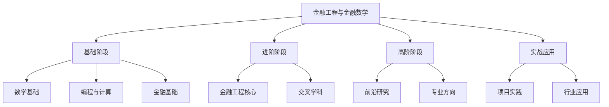
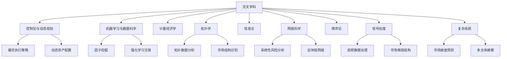
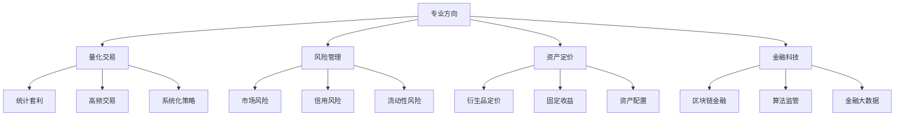
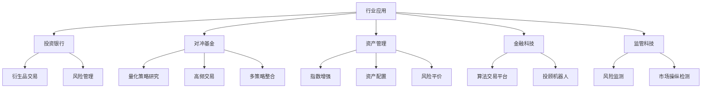
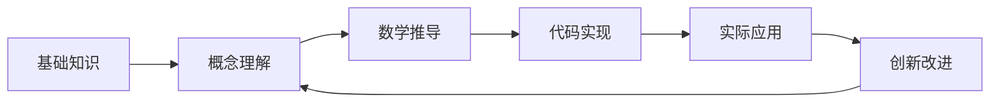
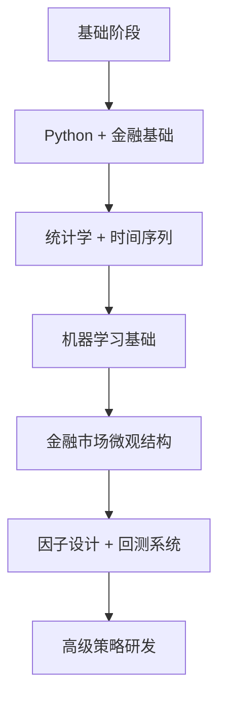
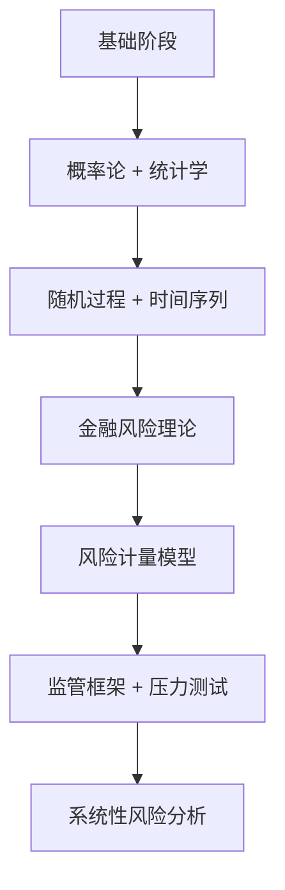
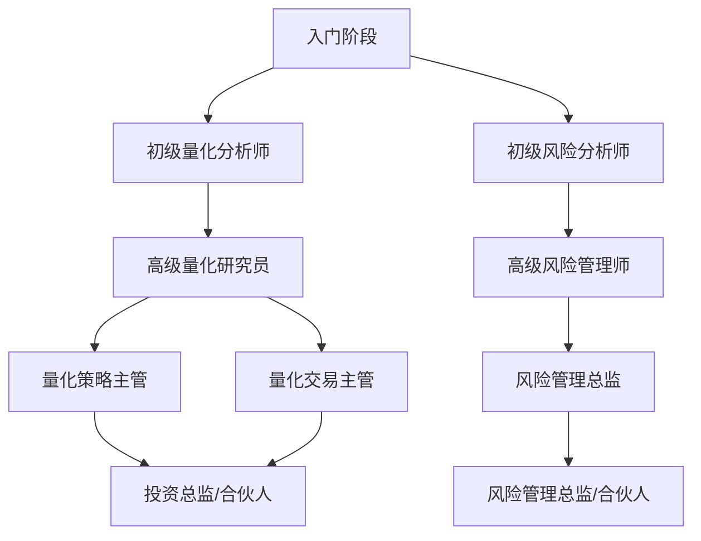

# 金融工程与金融数学学习路径优化

以下是对金融工程与金融数学学习路径的优化和补充，包括核心学科、交叉领域和实践路径。

## 总体学习框架

## 1. 基础阶段：数学与计算基石

### 1.1 核心数学基础

#### 概率论与统计学

* **核心内容** ：概率空间、随机变量、条件期望、大数定律、中心极限定理、统计推断
* **应用场景** ：风险评估、资产回报建模、统计套利
* **推荐教材** ：
* 《概率论与数理统计》（陈希孺）
* *All of Statistics* (Wasserman)

#### 随机过程

* **核心内容** ：马尔可夫链、泊松过程、布朗运动、鞅论
* **应用场景** ：资产价格动态模型、随机波动率模型
* **推荐教材** ：
* 《随机过程导论》(Sheldon Ross)
* *Stochastic Calculus for Finance I* (Shreve)

#### 最优化理论

* **核心内容** ：线性规划、凸优化、动态规划、梯度下降、拉格朗日乘数法
* **应用场景** ：投资组合优化、算法交易策略设计、风险控制
* **推荐教材** ：
* 《凸优化》(Boyd & Vandenberghe)
* 《动态规划与最优控制》(Bertsekas)

#### 偏微分方程

* **核心内容** ：抛物型方程、数值解法、边界条件
* **应用场景** ：期权定价模型、利率模型
* **推荐教材** ：
* *Partial Differential Equations for Finance* (Wilmott et al.)

### 1.2 编程与数值方法

#### 编程语言

* **主要语言** ：Python、R、C++
* **应用场景** ：Python/R用于研究和原型开发，C++用于高性能系统
* **学习路径** ：
* Python基础 → NumPy/Pandas → 金融库(QuantLib) → 机器学习框架

#### 数据结构与算法

* **核心内容** ：时间复杂度分析、树形结构、哈希表、图算法
* **应用场景** ：高效订单簿实现、交易算法优化

#### 数值计算方法

* **核心内容** ：蒙特卡洛模拟、有限差分法、数值积分、傅里叶变换
* **应用场景** ：复杂衍生品定价、市场风险模拟
* **工具库** ：SciPy、NumPy、TensorFlow

### 1.3 金融基础知识

#### 金融市场与资产类别

* **核心内容** ：股票、债券、外汇、衍生品市场结构
* **应用场景** ：跨市场策略开发、套利机会识别

#### 财务会计与报表分析

* **核心内容** ：财务报表解读、会计准则、财务比率分析
* **应用场景** ：基本面量化策略、信用风险建模

## 2. 进阶阶段：金融工程核心

### 2.1 随机微分方程与伊藤微积分

* **核心内容** ：伊藤积分、伊藤引理、扩散过程、Girsanov定理
* **应用场景** ：连续时间资产定价、随机波动率模型
* **推荐教材** ：
* *Stochastic Differential Equations* (Oksendal)
* *Stochastic Calculus for Finance II* (Shreve)

### 2.2 金融衍生品定价

* **核心内容** ：Black-Scholes模型、风险中性定价、波动率曲面、Greeks
* **应用场景** ：期权定价与对冲、结构化产品设计
* **推荐教材** ：
* *Options, Futures and Other Derivatives* (Hull)
* *The Volatility Surface* (Gatheral)

### 2.3 风险度量与管理

* **核心内容** ：VaR、CVaR、压力测试、Copula模型
* **应用场景** ：市场风险控制、信用风险评估
* **推荐教材** ：
* *Quantitative Risk Management* (McNeil et al.)

### 2.4 交叉学科扩展

#### 控制论与动态规划

* **核心内容** ：随机控制、最优停时、Hamilton-Jacobi-Bellman方程
* **应用场景** ：美式期权定价、最优执行策略
* **推荐教材** ：
* *Stochastic Control in Financial Engineering* (Bäuerle & Rieder)

#### 机器学习与数据科学

* **核心内容** ：监督/无监督学习、强化学习、深度学习
* **应用场景** ：因子挖掘、市场预测、异常检测
* **推荐教材** ：
* *Advances in Financial Machine Learning* (López de Prado)

#### 拓扑学应用

* **核心内容** ：持续性同调、流形学习
* **应用场景** ：系统性风险检测、市场结构分析
* **推荐教材** ：
* *Elementary Applied Topology* (Ghrist)
* *Topological Data Analysis for Genomics and Evolution* (Rabadán & Blumberg)

#### 信息论

* **核心内容** ：熵、KL散度、互信息
* **应用场景** ：市场效率测量、非线性依赖性检测
* **推荐教材** ：
* *Elements of Information Theory* (Cover & Thomas)

#### 网络科学

* **核心内容** ：图论、中心性度量、传染模型
* **应用场景** ：金融机构互联网络、系统性风险传播
* **推荐教材** ：
* *Networks, Crowds, and Markets* (Easley & Kleinberg)

#### 博弈论

* **核心内容** ：纳什均衡、拍卖理论
* **应用场景** ：市场微观结构、高频交易策略设计
* **推荐教材** ：
* *Game Theory* (Fudenberg & Tirole)
* *Algorithmic Game Theory* (Nisan et al.)

#### 信号处理与时间序列

* **核心内容** ：滤波技术、傅里叶/小波变换
* **应用场景** ：高频数据去噪、市场周期性分析
* **推荐教材** ：
* *Time Series Analysis* (Hamilton)
* *Adaptive Filter Theory* (Haykin)

#### 复杂系统与非线性动力学

* **核心内容** ：混沌理论、临界现象、多主体模拟
* **应用场景** ：市场崩盘预警、加密货币生态系统模拟
* **推荐教材** ：
* *Complexity and the Economy* (Arthur)
* *Nonlinear Dynamics and Chaos* (Strogatz)

## 3. 高阶阶段：专业方向与前沿领域

### 3.1 专业方向选择

#### 量化交易专业路径

* **核心课题** ：市场微观结构、统计套利、因子投资、高频交易
* **技能组合** ：
* 信号处理 + 机器学习 + 高性能计算
* 市场微观结构理论 + 执行算法设计
* **实践项目** ：构建回测框架、实时交易系统开发

#### 风险管理专业路径

* **核心课题** ：市场风险建模、信用评分、系统性风险监测
* **技能组合** ：
* 极值理论 + 时间序列分析 + 网络科学
* 压力测试设计 + 监管合规分析
* **实践项目** ：投资组合风险系统、信用评分模型

#### 金融科技专业路径

* **核心课题** ：区块链金融、算法监管、智能合约
* **技能组合** ：
* 分布式系统 + 密码学 + 博弈论
* 大数据处理 + 云计算架构
* **实践项目** ：DeFi协议设计、监管科技应用开发

### 3.2 前沿研究方向

#### 随机波动率与跳跃扩散模型

* **研究问题** ：如何更准确描述资产价格动态与尾部风险
* **代表模型** ：Heston模型、SABR模型、Merton跳跃扩散模型
* **应用领域** ：期权定价、投资组合风险管理

#### 量化宏观与利率模型

* **研究问题** ：如何建模宏观经济因素与利率期限结构
* **代表模型** ：短期利率模型(Vasicek、CIR)、LIBOR市场模型
* **推荐教材** ：*Interest Rate Models: Theory and Practice* (Brigo & Mercurio)

#### 深度学习在金融中的应用

* **研究方向** ：
* NLP在金融新闻/报告分析中的应用
* 深度强化学习在交易策略中的应用
* 图神经网络在金融网络分析中的应用
* **挑战** ：可解释性、样本外性能、模型风险

#### 可持续金融与ESG量化

* **研究方向** ：气候风险定价、ESG因子构建、绿色金融产品设计
* **数据与方法** ：替代数据源处理、自然语言处理、因果推断

## 4. 实战应用阶段

### 4.1 项目与竞赛

* **开源项目参与** ：
* GitHub上的金融开源库贡献（如QuantLib、zipline）
* 复现经典论文及开发改进版本（如因子模型、期权定价）
* **竞赛平台** ：
* Kaggle金融类竞赛
* QuantConnect Alpha比赛
* WorldQuant BRAIN平台

### 4.2 行业应用场景

#### 投资银行应用

* **主要岗位** ：衍生品交易员、量化分析师、风险管理师
* **核心技能** ：衍生品定价、风险对冲、交易策略设计
* **项目实例** ：结构化产品设计、交易簿风险管理系统

#### 对冲基金应用

* **主要岗位** ：量化研究员、策略开发者、数据科学家
* **核心技能** ：因子研究、统计套利、机器学习预测
* **项目实例** ：多资产多时间框架的因子模型、高频交易信号系统

#### 资产管理应用

* **主要岗位** ：量化投资组合经理、风险分析师
* **核心技能** ：资产配置、风险平价、因子投资
* **项目实例** ：智能贝塔策略、多资产风险平价模型

#### 金融科技应用

* **主要岗位** ：金融工程师、区块链开发者、算法设计师
* **核心技能** ：分布式系统、智能合约、大数据分析
* **项目实例** ：去中心化交易所设计、流动性挖矿协议

#### 监管科技应用

* **主要岗位** ：合规分析师、风险监测专家
* **核心技能** ：网络科学、异常检测、市场监控算法
* **项目实例** ：系统性风险早期预警系统、市场操纵行为检测

## 5. 学习资源整合

### 5.1 经典教材梳理

| 学科领域             | 入门教材                                                  | 进阶教材                                                         | 前沿论文集                                                      |
| -------------------- | --------------------------------------------------------- | ---------------------------------------------------------------- | --------------------------------------------------------------- |
| 金融数学基础         | *《金融数学基础》*(Pliska)                              | *《数学金融学引论》*(Øksendal)                                | -                                                               |
| 随机过程与伊藤微积分 | *《随机过程导论》*(Ross)                                | *《金融随机分析》*(Shreve)                                     | *《Brownian Motion and Stochastic Calculus》*(Karatzas)       |
| 衍生品定价           | *《期权、期货及其他衍生品》*(Hull)                      | *《The Concepts and Practice of Mathematical Finance》*(Joshi) | *《The Volatility Surface》*(Gatheral)                        |
| 风险管理             | *《金融风险管理》*(Jorion)                              | *《Quantitative Risk Management》*(McNeil)                     | -                                                               |
| 量化交易             | *《量化交易：如何建立自己的算法交易事业》*(Ernest Chan) | *《量化投资策略》*(Kakushadze & Serur)                         | *《Advances in Financial Machine Learning》*(López de Prado) |
| 金融机器学习         | *《Python金融大数据分析》*                              | *《Machine Learning for Asset Managers》*(López de Prado)     | JFDS期刊论文                                                    |

### 5.2 在线学习平台

* **MOOC课程** ：
* Coursera金融工程专项课程
* edX金融计算MicroMasters项目
* MIT OpenCourseWare金融数学课程
* **实践平台** ：
* QuantConnect - 算法交易平台
* Kaggle - 数据科学竞赛
* WorldQuant BRAIN - 策略开发平台

### 5.3 开源工具与库

* **Python生态** ：
* **金融建模** ：QuantLib-Python, PyAlgoTrade, Zipline
* **数据处理** ：Pandas, NumPy, SciPy
* **机器学习** ：Scikit-learn, PyTorch, TensorFlow
* **可视化** ：Matplotlib, Seaborn, Plotly
* **R生态** ：
* **金融分析** ：quantmod, PerformanceAnalytics
* **时间序列** ：forecast, xts
* **Julia生态** ：
* **金融建模** ：QuantLib.jl, Ito.jl
* **优化** ：JuMP, Convex.jl

## 6. 学习策略与实践建议

### 6.1 渐进式学习路径

1. **T型知识结构培养**
   * 广度：跨领域基础知识覆盖
   * 深度：至少一个专业方向的深入研究
2. **理论与实践结合**
   * 学习一个概念 → 推导公式 → 编程实现 → 实际应用
3. **项目驱动学习**
   * 从简单问题开始（如期权定价模型实现）
   * 逐步过渡到复杂系统（如多因子模型、交易系统）

### 6.2a 深度学习推荐路径：量化交易方向

1. **第1-3个月** ：Python编程 + 金融市场基础
2. **第4-6个月** ：统计学 + 时间序列分析
3. **第7-9个月** ：机器学习基础 + 金融数据处理
4. **第10-12个月** ：市场微观结构 + 初级策略设计
5. **第13-18个月** ：因子设计 + 回测系统开发
6. **第19-24个月** ：高级策略研发 + 实盘交易系统

### 6.2b 深度学习推荐路径：风险管理方向

1. **第1-3个月** ：概率论 + 统计学
2. **第4-6个月** ：随机过程 + 金融时间序列
3. **第7-9个月** ：金融风险理论 + 风险指标
4. **第10-12个月** ：VaR/CVaR模型 + 信用风险
5. **第13-18个月** ：风险监管框架 + 压力测试
6. **第19-24个月** ：系统性风险分析 + 风险管理系统

### 6.3 学习效率提升策略

1. **费曼技巧应用**
   * 学习新概念后尝试用简单语言向"假想的学生"解释
   * 创建博客或录制视频讲解复杂金融概念
2. **知识图谱构建**
   * 使用思维导图工具构建金融数学知识体系
   * 建立概念之间的逻辑关联
3. **社区参与**
   * 加入QuantNet、Wilmott论坛等量化金融社区
   * 参与开源项目贡献
   * 参加行业会议和研讨会
4. **复现经典研究**
   * 复现经典论文的模型和结果
   * 在GitHub上分享代码实现
   * 探索改进方向

## 7. 行业发展趋势与未来方向

### 7.1 技术趋势

* **深度学习在金融中的应用深化**
  * 图神经网络在金融网络分析中的应用
  * 强化学习在动态资产配置中的应用
  * 大型语言模型在金融文本分析中的应用
* **区块链与分布式金融**
  * 去中心化金融(DeFi)产品定价与风险管理
  * 智能合约形式化验证
  * 加密资产定价模型
* **量化可持续金融**
  * 气候风险建模与定价
  * ESG因子构建与影响力测量
  * 可持续投资策略设计

### 7.2 职业发展路径

* **从业建议**
  * 培养专业深度与技术广度的平衡
  * 持续学习新技术与方法
  * 建立行业人脉网络
  * 关注监管与市场发展

## 总结

金融工程与金融数学是一个融合数学、统计、计算机科学和金融理论的跨学科领域。通过系统的学习路径和实践应用，可以从基础理论到前沿应用逐步掌握这一领域的知识和技能。成功的金融工程师需要具备扎实的数学基础、编程技能、金融知识，以及持续学习和创新的能力。
