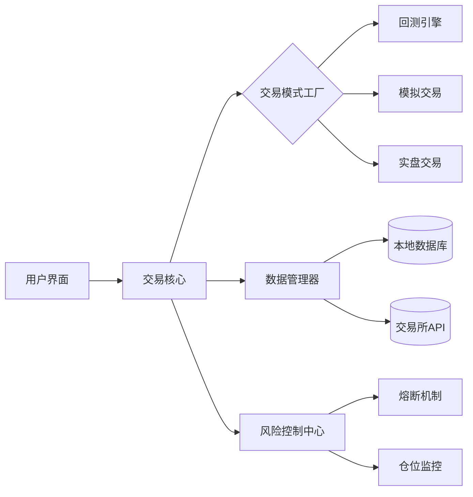

# Crypto Quantitative Trading System - 用户指南


[](https://github.com/your-org/crypto-trading-system/wiki)

## 🧭 导航
- [系统概述](#-系统概述)  
- [快速入门](#-快速入门)  
- [核心功能详解](#-核心功能详解)  
- [高级配置](#-高级配置)  
- [安全与监控](#-安全与监控)  
- [故障排查](#-故障排查)  
- [API参考](#-api参考)  

---

## 🌐 系统概述

### 架构全景


### 关键特性

- **多模式支持**：无缝切换回测/模拟/实盘模式
- **策略热加载**：运行时动态更新交易策略
- **数据融合引擎**：聚合多交易所实时数据流
- **风控沙盒**：交易前策略安全验证
- **智能重试机制**：网络异常自动恢复

---

## 🚀 快速入门

### 环境准备

```bash
# 安装系统依赖
sudo apt-get install -y redis-server postgresql

# 克隆仓库（开发者模式）
git clone --recurse-submodules https://github.com/your-org/crypto-trading-system.git
cd crypto-trading-system

# 初始化Python环境
python -m venv .venv && source .venv/bin/activate
pip install -r requirements-dev.txt
```

### 首次运行

1. 复制配置文件模板

```bash
cp configs/template/config.prod.yaml configs/local/
```

2. 配置数据库连接

```yaml
# configs/local/database.yaml
postgres:
  host: localhost
  port: 5432
  database: trading
  user: quant
  password: securepass123
```

3. 启动核心服务

```bash
python -m src.launcher --env=local --log-level=INFO
```

---

## 🔧 核心功能详解

### 策略开发框架

1. **创建策略模板**

```python
from core.strategies import BaseStrategy
from core.types import Signal

class MeanReversionStrategy(BaseStrategy):
    def __init__(self, config: dict):
        super().__init__(config)
        self.window_size = config.get('window_size', 14)
      
    async def generate_signals(self, data: pd.DataFrame) -> List[Signal]:
        # 计算布林带指标
        rolling_mean = data['close'].rolling(self.window_size).mean()
        ...
        return signals
```

2. **策略注册**

```yaml
# strategies/config.yaml
registered_strategies:
  - name: MeanReversion
    class: strategies.mean_reversion.MeanReversionStrategy
    params:
      window_size: 20
      threshold: 2.0
```

### 回测工作流

```bash
# 运行多资产回测
python -m src.tools.backtester \
  --strategy=MeanReversion \
  --start=2023-01-01 \
  --end=2023-06-30 \
  --assets=BTC/USDT,ETH/USDT \
  --output=reports/backtest_summary.html
```

### 实盘交易配置

```yaml
# configs/live/binance.yaml
exchange:
  name: binance
  api_key: ENC(AES256_encrypted_key_here)
  secret: ENC(AES256_encrypted_secret_here)
  symbols:
    - BTC/USDT
    - ETH/USDT

execution:
  order_type: TWAP
  slippage: 0.001
  timeout: 30s
```

---

## ⚙️ 高级配置

### 分布式部署

```yaml
# configs/cluster.yaml
cluster:
  nodes:
    - name: data-node-1
      role: data_processor
      resources:
        cpu: 8
        memory: 32Gi
    - name: risk-node-1 
      role: risk_manager
      resources:
        gpu: 1
```

### 性能优化参数

```python
# src/core/optimization.py
PERF_CONFIG = {
    'data_buffer_size': 5000,   # 数据预加载窗口
    'max_workers': 8,           # 异步工作线程数
    'cache_ttl': '5m',          # Redis缓存时效
    'batch_size': 1000          # 数据库批量写入量
}
```

---

## 🔒 安全与监控

### 密钥管理流程

```bash
# 生成加密密钥对
python -m src.tools.crypto init

# 加密API密钥
python -m src.tools.crypto encrypt \
  --input=secrets/api_keys.json \
  --output=configs/encrypted/
```

### Prometheus监控指标

| 指标名称                | 类型    | 描述                 |
| ----------------------- | ------- | -------------------- |
| strategy_signals_total  | Counter | 生成交易信号总数     |
| order_execution_latency | Summary | 订单执行延迟（毫秒） |
| risk_events_triggered   | Gauge   | 触发的风控事件数量   |

---

## 🛠️ 故障排查

### 常见错误代码

| 代码  | 含义             | 解决方案               |
| ----- | ---------------- | ---------------------- |
| E1001 | 数据源连接失败   | 检查网络/API密钥有效性 |
| E2003 | 策略参数验证错误 | 验证策略配置文件语法   |
| E3008 | 交易所限流       | 启用请求队列自动降级   |

### 调试模式

```bash
# 启用详细日志
python -m src.launcher --log-level=DEBUG

# 实时性能分析
python -m src.tools.profiler --attach-to-process 12345
```

---

## 📚 API参考

### 核心接口

```python
class TradingCore:
    def initialize(self, config: dict) -> None:
        """初始化交易核心组件"""
      
    async def run_backtest(self, params: BacktestParams) -> BacktestResult:
        """执行历史回测"""
      
    def register_strategy(self, strategy: Type[BaseStrategy]) -> bool:
        """注册新交易策略"""
```

### WebSocket数据接口

```javascript
// 实时市场数据订阅
const ws = new WebSocket('wss://api.quant-system.com/v1/stream');
ws.onmessage = (event) => {
    const data = JSON.parse(event.data);
    // 处理BTC/USDT实时报价
    if(data.symbol === 'BTC/USDT') {
        updatePriceChart(data);
    }
};
```

---

## 📞 技术支持

- **紧急响应**：security@quant-system.com
- **社区支持**：[Discord频道](https://discord.gg/quant-trading)
- **文档中心**：[在线Wiki](https://github.com/your-org/crypto-trading-system/wiki)

---

> **法律声明**：本系统遵循MIT开源协议，使用者需自行承担交易风险。建议在生产环境部署前进行全面的安全审计。
>
