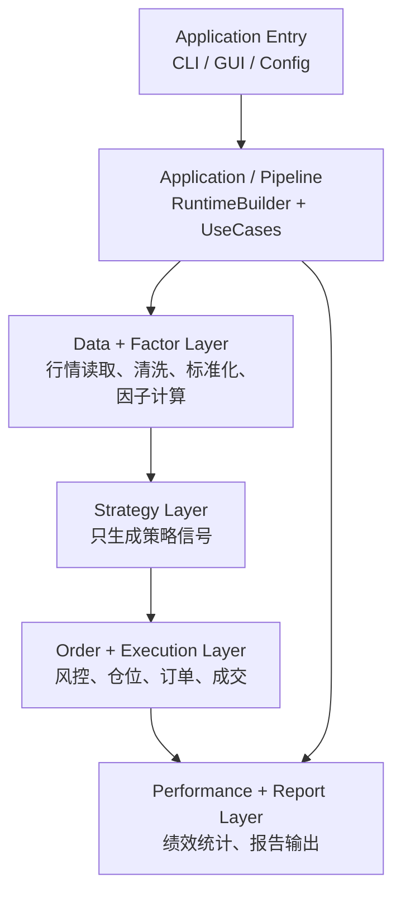

# 量化交易系统最终四层解耦架构方案

日期：2026-06-09

## 1. 目标

本方案用于统一项目后续架构演进方向。当前项目已经完成主交易链路的领域化改造：在 `RuntimeBuilder` 组装的新路径中，`BacktestUseCase / PaperTradingUseCase / LiveTradingUseCase` 已经可以通过 `DomainTradingPipeline` 串起行情、策略、风控、执行、组合账本和报告。

但当前仍处于“新主链路已领域化，旧实现和旧 fallback 仍通过 adapter 兼容”的阶段。后续目标不是继续堆 adapter，而是把项目收敛成清晰的四层业务架构：

```text
Data + Factor 层
-> Strategy 层
-> Order + Execution 层
-> Performance + Report 层
```

同时保留一个薄的 Application / Pipeline 编排层，负责把四层组件按配置组装起来，但不承担具体业务判断。

## 2. 当前真实状态

### 2.1 已完成的部分

- `src/domain` 已经成为相对干净的领域核心，不依赖 `pandas`、mode、config、具体策略、具体风控、执行引擎或交易所。
- 主交易协议已经迁移为：

```text
MarketSlice
-> StrategySignal
-> RiskDecision
-> OrderIntent
-> Fill
-> PortfolioSnapshot
```

- `RuntimeBuilder` 已经作为运行时组装入口，统一创建 feed、strategy adapter、risk policy、execution model、portfolio、reporter 和 use case。
- backtest、paper、live 在 `RuntimeBuilder` 新路径中已经共用 `DomainTradingPipeline`；旧 DataFrame application pipeline wrapper 和旧 `ExecutionEngine` 兼容入口本体已删除，剩余旧 DataFrame 兼容主要集中在显式 legacy strategy/risk adapter。
- `PortfolioBook` 已经成为现金、持仓、净值和回撤的主要事实来源。
- `InMemoryReporter` 已经可以通过记录 `Fill` 和 `PortfolioSnapshot` 生成兼容报告。

### 2.2 尚未完全解耦的部分

当前仍存在以下旧耦合和重复职责：

- `src/strategy` 仍使用旧接口：`process_data(DataFrame, symbol) -> DataFrame`。
- 因子注册、因子计算、数据 buffer 管理仍混在 `BaseStrategy` 和具体策略里。
- `DualMAStrategy`、`MultiFactorsStrategy` 仍在策略内部计算下单数量，仓位 sizing 没有完全迁到风控或订单层。
- `src/backtest/engine.py` 仍是旧的大型回测引擎，内部混合数据缓存、因子计算、策略调用、组合模拟和绩效统计。
- `src/application/trading_pipeline.py` 已删除，旧 DataFrame `TradingPipeline` 的可迁移行为已映射到 adapter/domain risk/risk adapter 测试。
- `BaseTradingMode._process_market_data` 已删除；mode 层不再暴露旧 DataFrame market-data pipeline 入口。
- performance/report 相关职责分散在 `src/backtest/performance.py`、`src/application/reporting.py`、`src/application/report_use_case.py`。
- CLI 仍保留 `--backtest-engine` 参数，但当前主 CLI 并不直接使用旧 `src/backtest/engine.py`，命名容易误导。

## 3. 推荐最终架构

### 3.1 总体分层



### 3.2 Data + Factor 层

职责：

- 读取本地历史数据和实时行情。
- 做数据清洗、标准化、时区统一、缺失值处理。
- 统一输出领域行情对象，例如 `MarketSlice`。
- 计算技术指标、因子、特征，并输出 `FactorSnapshot` 或带因子的市场视图。

建议目录：

```text
src/datasource/
src/factor/
```

后续可以从 `src/strategy/factor_lib.py`、`BaseStrategy._factor_registry`、旧 backtest engine 的 factor cache 中抽出公共因子能力，形成独立 `FactorEngine`。

边界要求：

- Data 层可以使用 `pandas`、parquet、ccxt、数据库。
- Factor 层可以使用 `pandas`、numpy、ta-lib 等计算工具。
- 但 Strategy 层不应自己取数据，不应自己维护原始行情 buffer。

### 3.3 Strategy 层

职责：

- 只根据标准化后的市场数据、因子视图和组合快照生成 `StrategySignal`。
- 不取数据。
- 不调用执行引擎。
- 不修改组合账本。
- 不写报告。
- 不决定最终成交结果。

当前 `src/domain/ports.py` 中的策略端口仍是 v1 接口：

```python
class StrategyPort:
    async def generate(
        self,
        market,
        portfolio,
    ) -> list[StrategySignal]:
        ...
```

抽出 Factor 层后，目标 v2 接口再升级为：

```python
class StrategyPort:
    async def generate(
        self,
        market,
        factors,
        portfolio,
    ) -> list[StrategySignal]:
        ...
```

策略可以表达：

- 买、卖、观望。
- 信号强度。
- 目标方向。
- 参考价格。
- 策略建议权重或建议风险预算。

策略不应该直接决定：

- 最终下单数量。
- 是否允许交易。
- 用什么成交价成交。
- 账户现金和持仓如何变化。

当前 `legacy_strategy_adapter.py` 仍然需要保留，直到旧策略全部迁移到新接口。

### 3.4 Order + Execution 层

职责：

- 将策略信号转成风控决策。
- 根据账户状态、风险预算、最大仓位、最小订单金额、交易所规则做 sizing。
- 将通过风控的信号转成 `OrderIntent`。
- 在回测、模拟盘、实盘中分别生成 `Fill`。
- 不直接写报告。
- 不让策略绕过风控直接下单。

建议拆分：

```text
RiskPolicy
PositionSizer
OrderFactory
ExecutionModel
PortfolioBook
```

推荐流程：

```text
StrategySignal
-> RiskDecision
-> PositionSizingDecision
-> OrderIntent
-> Fill
-> PortfolioBook.apply_fill()
```

当前 `BacktestExecutionModel`、`PaperExecutionModel`、`LiveExecutionModel` 可以继续保留并演进。旧 `ExecutionEngine.execute(signals_df)` 兼容入口本体已删除，不再作为主执行入口或 legacy 执行兜底。

### 3.5 Performance + Report 层

职责：

- 接收交易事件和组合快照。
- 计算收益率、回撤、胜率、盈亏比、夏普、交易统计。
- 输出 JSON、CSV、HTML 或图表报告。
- 不参与策略判断。
- 不参与风控和执行。

建议拆分：

```text
Reporter
PerformanceAnalyzer
ReportWriter
```

推荐流程：

```text
Fill + PortfolioSnapshot
-> Reporter
-> PerformanceAnalyzer
-> ReportWriter
```

当前 `InMemoryReporter` 可以作为事件收集器继续使用。`src/backtest/performance.py` 中可复用的指标计算逻辑，应迁移到独立 `PerformanceAnalyzer`，而不是继续和回测引擎绑定。

### 3.6 Application / Pipeline 层

职责：

- 根据 config 创建组件。
- 选择运行模式：backtest、paper、live。
- 调用 use case。
- 管理启动、关闭和安全门。
- 保持 CLI/GUI 入口稳定。

它不应该包含：

- 策略规则。
- 风控规则。
- 执行成交细节。
- 因子计算细节。
- 报告指标公式。

当前 `RuntimeBuilder`、`BacktestUseCase`、`PaperTradingUseCase`、`LiveTradingUseCase` 就属于这一层。

## 4. 推荐目录结构

建议逐步收敛为：

```text
src/
  application/
    runtime_builder.py
    backtest_use_case.py
    paper_trading_use_case.py
    live_trading_use_case.py

  domain/
    models.py
    ports.py
    trading_pipeline.py
    portfolio.py

  datasource/
    feeds/
    stores/
    normalizer.py
    manager.py

  factor/
    engine.py
    indicators.py
    registry.py

  strategy/
    base.py
    implementations/

  risk/
    policies.py
    sizing.py

  order/
    factory.py
    models.py

  execution/
    backtest_model.py
    paper_model.py
    live_model.py

  reporting/
    reporter.py
    performance_analyzer.py
    writers.py

  trading/
    modes/

  ui/
  core/
  common/
```

短期不必一次性移动所有文件。更稳妥的方式是先新增目标模块，再逐步迁移调用方，最后删除旧兼容模块。

## 5. 当前模块去留建议

### 5.1 保留并继续演进

- `src/domain/models.py`
- `src/domain/ports.py`
- `src/domain/trading_pipeline.py`
- `src/domain/portfolio.py`
- `src/application/runtime_builder.py`
- `src/application/backtest_use_case.py`
- `src/application/paper_trading_use_case.py`
- `src/application/live_trading_use_case.py`
- `src/datasource/feeds/market_data_feed.py`
- `src/trading/execution/backtest_model.py`
- `src/trading/execution/paper_model.py`
- `src/trading/execution/live_model.py`

### 5.2 暂时保留，作为 legacy 兼容层

- `src/application/adapters/legacy_strategy_adapter.py`
- `src/application/adapters/legacy_risk_policy_adapter.py`
- `src/application/adapters/dataframe_domain_adapter.py`

这些模块只服务显式 legacy strategy/risk 兼容。旧 application DataFrame pipeline wrapper、mode 层 `_process_market_data` 入口、`LegacyExecutionAdapter` 和 `src/trading/execution/manager.py` 已删除。

### 5.3 建议逐步拆分或废弃

- `src/backtest/engine.py`
  - 当前主 CLI 不直接依赖它。
  - 内部混合数据、因子、策略、执行和绩效，建议标记为 legacy。
- `src/backtest/performance.py`
  - 指标计算可以迁移到 `src/reporting/performance_analyzer.py`。
  - 文件输出可以迁移到 `src/reporting/writers.py`。
- `src/strategy/base.py`
  - 应去掉数据 buffer 和 factor registry 职责。
  - 最终只保留策略接口、初始化和生命周期。
- `src/strategy/factor_lib.py`
  - 应迁移到独立 `src/factor`。

## 6. 分阶段实施建议

### Phase A：架构边界审计和命名清理

目标：先避免误解和误用。

工作：

- 明确当前 CLI 不使用旧 `src/backtest/engine.py`。
- 将旧 `BacktestEngine` 相关文档和类标记为 legacy。
- 梳理 `--backtest-engine` 参数含义，决定改名为 `--execution-model` 或保留但重新解释。
- 新增测试，证明 CLI 主路径没有调用 `BacktestFactory.run_backtest()`。

验收：

- 新开发者能从文档看懂当前主路径。
- `src/backtest/engine.py` 不再被误认为当前主回测核心。

### Phase B：抽出 Factor 层

目标：把因子计算从 strategy 和 backtest engine 中剥离。

工作：

- 新增 `src/factor/engine.py`。
- 新增 `FactorSnapshot` 或 `FactorView`。
- 将 `factor_lib.py` 中通用指标迁到 `src/factor`。
- 将 `BaseStrategy._factor_registry` 和 `calculate_factor` 的职责迁移到 `FactorEngine`。
- `MarketDataFeed` 或 use case 在调用策略前先生成 factor view。

验收：

- 策略不再维护原始数据 buffer。
- 策略只读取 factor view，不自己计算通用因子。
- 旧策略仍可通过 adapter 兼容。

### Phase C：现代化 Strategy 层

目标：新策略不再使用 DataFrame 接口。由于当前 `StrategyPort` v1 尚不接收 factors，本阶段可以先让新策略接收 `market + portfolio`；待 Phase B 的 Factor 层落地后，再升级到 `market + factors + portfolio`。

工作：

- 确认当前 `StrategyPort.generate(market, portfolio)` 边界，并预留升级到 `StrategyPort.generate(market, factors, portfolio)` 的迁移点。
- 新增 `BaseDomainStrategy`。
- 将 `DualMA` 改写为新策略示例。
- 新策略输出 `StrategySignal`，不输出 DataFrame。
- 新策略不计算最终 quantity，只输出方向、强度、可选目标权重。

验收：

- `dual_ma` 可以不经过 `LegacyDataFrameStrategyAdapter` 跑通基线回测。
- adapter 只服务旧策略。

### Phase D：拆出 Sizing / Order 层

目标：把仓位计算从策略中移走。

工作：

- 新增 `PositionSizer`。
- 新增 `OrderFactory`。
- 将 `calculate_position_size()` 从策略迁到 sizing。
- 风控决策和 sizing 决策共同生成 `OrderIntent`。
- 支持固定金额、固定比例、波动率目标、最大仓位等 sizing 规则。

验收：

- 策略不再读初始资金来计算数量。
- 风控和 sizing 可以单独测试。
- 订单数量只由 Order + Execution 层决定。

### Phase E：统一 Performance / Report 层

目标：报告与回测引擎、mode 状态彻底分离。

工作：

- 新增 `src/reporting/performance_analyzer.py`。
- 新增 `src/reporting/writers.py`。
- 将 `src/backtest/performance.py` 中可复用指标迁移出来。
- `TradingReportUseCase` 只协调 reporter、analyzer 和 writer。
- 解决 CLI 输出完整 equity curve 过长的问题。

验收：

- 报告生成不依赖 mode 私有状态。
- 报告输出可以独立测试。
- JSON、CSV、HTML 输出职责清晰分开。

### Phase F：删除旧兼容链路

目标：从“通过 adapter 兼容”进入“新接口原生运行”。

工作：

- 删除或归档 `src/application/trading_pipeline.py`。
- 删除 `BaseTradingMode` 中旧 `_process_market_data`、`_execute_signals` 等 DataFrame 执行入口。
- 删除不再使用的 `LegacyExecutionAdapter`。
- 将 `src/backtest/engine.py` 标记废弃或移动到 `src/legacy`。
- 清理 `--backtest-engine` 的旧语义。

验收：

- 主链路没有旧 DataFrame pipeline。
- 策略、风控、执行、报告均通过新端口协作。
- 完整测试和基线回测保持通过。

## 7. 最终验收标准

完成本方案后，应满足：

- `src/strategy` 不再依赖数据获取、执行引擎、组合账本变更和报告输出。
- 新策略不再必须使用 `pandas.DataFrame` 作为输入输出。
- 因子计算在 `src/factor` 中统一管理。
- 仓位 sizing 不在策略中完成。
- `src/backtest/engine.py` 不再作为主系统核心存在。
- `src/application/trading_pipeline.py` 被删除或降级为明确 legacy。
- `ExecutionEngine.execute(signals_df)` 不再是主执行入口。
- performance/reporting 层只消费事件和快照，不反向影响交易流程。
- CLI 主路径清晰可追踪：

```text
CLI
-> TradingCore
-> TradingMode
-> UseCase
-> RuntimeBuilder
-> DomainTradingPipeline
-> Strategy / Risk / Order / Execution / Portfolio / Reporter
```

## 8. 推荐优先级

第一轮收敛已按以下顺序完成：

1. Phase A：架构边界审计和命名清理。
2. Phase D-min：先实现最小可用 `PositionSizer / OrderFactory`，让订单数量有策略外的归属。
3. Phase C：现代化 Strategy 层，先让 `dual_ma` 原生实现 `StrategyPort`，只输出方向、强度或目标权重。
4. Phase B：抽出 Factor 层，把旧策略中的 buffer、factor registry 和通用指标迁出。
5. Phase E：统一 Performance / Report 层。
6. Phase F：删除旧兼容链路。

原因：

- Phase D-min 和 Phase C 可以合并执行，但不能只做 C 而不提供 sizing 落点，否则新 `dual_ma` 仍会被迫在策略里计算 `quantity`。
- 这几步直接解决你最关心的“策略不应该成为主干、不应该决定执行细节”的问题。
- Factor 层很重要，但可以在策略接口和 sizing 边界稳定后分阶段抽出。
- Performance 层可以稍后清理，因为它不影响下单安全和交易主链路。

## 9. 下一轮收敛：native multi_factors 和可配置 FactorEngine

第一轮完成后，系统已经具备四层架构骨架，但旧策略生态还没有完全迁出 DataFrame 接口。下一轮不建议直接把 `strategy.interface` 默认值改成 `domain`，因为当前只有 `dual_ma` 已有原生实现，旧 `multi_factors` 仍依赖 `BaseStrategy`、`ConfigManager`、`pandas.DataFrame`、factor registry、data buffer 和策略内 sizing。

下一轮推荐目标：

- 扩展 `src/factor`，让 `FactorEngine` 支持配置化技术因子：`rsi`、`macd`、`bollinger`、`volume_osc` 和 `composite_signal`。
- 新增 `DomainMultiFactorsStrategy`，只消费 `MarketSlice + FactorView + PortfolioSnapshot`，只输出 `StrategySignal`。
- `DomainMultiFactorsStrategy` 不 import pandas、不维护原始行情 buffer、不计算最终 `quantity`。
- `RuntimeBuilder` 支持 `strategy.interface=domain` 且 `strategy.active=multi_factors` 时选择原生策略。
- 旧 `MultiFactorsStrategy` 和 `LegacyDataFrameStrategyAdapter` 暂时保留，用于兼容旧配置和保护基线。

推荐顺序：

1. 扩展 `FactorEngine` 的配置化因子能力。
2. 实现 `DomainMultiFactorsStrategy` 的阈值穿越信号。
3. 接入 `RuntimeBuilder`。
4. 跑 native multi_factors 聚焦测试、全量测试和既有 `dual_ma` 基线回测。
5. 在 `dual_ma` 和 `multi_factors` 均有 native 实现后，再评估是否把 `strategy.interface` 默认值从 `legacy` 改成 `domain`。

验收：

- `src/factor` 负责 multi-factor 所需的历史窗口和因子计算。
- 原生 `multi_factors` 不经过 `LegacyDataFrameStrategyAdapter` 即可进入 `DomainTradingPipeline`。
- 原生 `multi_factors` 不输出最终 `quantity`。
- 旧 `dual_ma` 基线回测保持不变。

## 10. 默认化策略接口：配置默认 domain，代码默认 domain

在 `dual_ma` 和 `multi_factors` 均具备 native 实现后，可以开始默认化 `strategy.interface=domain`。推荐采用保守默认化：

- `conf/config.yaml` 明确写入 `strategy.interface: domain`，让主配置和 CLI 默认运行走 native domain 路径。
- `RuntimeBuilder._strategy_interface()` 的代码默认值切换为 `domain`，让未声明 `strategy.interface` 的配置默认进入 native domain runtime。
- 只有显式 `strategy.interface=legacy` 才会启用 legacy adapter，用于保护明确声明旧接口的配置和测试。
- `conf/strategy.yaml` 作为示例文件保留 `legacy` / `domain` 说明，不作为主运行默认依据。
- 默认化后需要重新记录 native `dual_ma` 基线；如果结果与旧 legacy 基线不同，应明确标注这是策略接口、sizing 和去重语义迁移导致的预期差异。

验收：

- 主配置 `conf/config.yaml` 的 `strategy.interface` 为 `domain`。
- 代码层未声明 interface 的配置默认 domain。
- 显式 `strategy.interface=legacy` 的配置仍可进入 legacy adapter 兼容入口。
- 默认 CLI 回测进入 native domain 策略路径。
- 完整测试通过，并记录默认 native 基线数值。

## 11. legacy 删除暂缓与删除门禁

当前不建议一次性删除全部 legacy 兼容层。主配置 `conf/config.yaml` 已经通过 `strategy.interface=domain` 进入 native `DomainTradingPipeline`，未声明 `strategy.interface` 的配置默认进入 domain runtime；旧 application DataFrame pipeline wrapper 已删除，但以下兼容入口仍有明确用途，删除前必须先完成替代或迁移：

- 显式 `strategy.interface=legacy` 的配置仍由 `RuntimeBuilder` 进入 `LegacyDataFrameStrategyAdapter` 和 `LegacyRiskPolicyAdapter`。
- `src/application/trading_pipeline.py` 已删除；`BaseTradingMode._process_market_data` 已删除；旧 DataFrame `TradingPipeline` 的可迁移行为已映射到 adapter/domain risk/risk adapter 测试。
- live 默认路径已解除旧 `ExecutionEngine` exchange client ownership；`ExecutionEngine` 不再由 backtest/paper 初始化主路径主动创建，live 默认路径已通过独立 `Binance` adapter 持有 exchange client。`RuntimeBuilder._exchange_client()` 不再读取 `mode.execution_engine.binance`，live runtime 只接受显式 `mode.exchange_client`。live 默认路径已删除旧 `ExecutionEngine` fallback，`live_trading.allow_legacy_execution_engine_fallback=true` 不再创建旧 `ExecutionEngine`。
- `tests/test_trading_pipeline.py` 已删除；当前时间/去重、空仓卖出、超额卖出 clamp、risk reject 的行为事实来源已经分别迁到 strategy adapter、domain risk policy 和 risk adapter 测试。`tests/test_execution_engine.py` 已删除；旧 `ExecutionEngine._backtest_execution` 行为事实来源已迁移到 `tests/test_backtest_execution_model.py`。`LegacyExecutionAdapter` 已删除；`src/trading/execution/manager.py` 已删除；旧执行桥和旧 `ExecutionEngine.execute(signals_df)` 兼容入口本体已删除。`tests/test_legacy_strategy_adapter.py` 和 `tests/test_legacy_risk_policy_adapter.py` 仍在保护显式 legacy strategy/risk 兼容行为。

旧配置 fallback 已删除：未声明 `strategy.interface` 的配置默认进入 domain runtime；`RuntimeBuilder._strategy_interface(default="domain")` 是代码层默认行为。只有显式 `strategy.interface=legacy` 才会启用 legacy adapter，用于保护明确声明旧接口的配置和测试。

旧 DataFrame pipeline wrapper 已删除：`src/application/trading_pipeline.py` 已删除，`BaseTradingMode._process_market_data` 已删除，`tests/test_trading_pipeline.py` 已删除。旧 DataFrame `TradingPipeline` 的可迁移行为已映射到 adapter/domain risk/risk adapter 测试。`tests/test_execution_engine.py` 已删除；旧 `ExecutionEngine._backtest_execution` 行为事实来源已迁移到 `tests/test_backtest_execution_model.py`；`src/trading/execution/manager.py` 已删除；旧 `ExecutionEngine.execute(signals_df)` 兼容入口本体已删除。

旧 `ExecutionEngine._backtest_execution` fractional quantity/volume 行为已映射到 `BacktestExecutionModel.execute_orders()` 覆盖。`tests/test_backtest_execution_model.py` 覆盖 fractional crypto quantity 与 integer volume fractional decrement；旧 `tests/test_execution_engine.py` 已删除，不再作为 legacy DataFrame `ExecutionEngine` 兼容对照。

旧 `ExecutionEngine._backtest_execution` 曾被收窄为 `BacktestExecutionModel.execute_orders()` 委托 wrapper，随后随 `src/trading/execution/manager.py` 一并删除。回测成交算法事实来源是 `BacktestExecutionModel`，不是旧 `ExecutionEngine`；边界测试会阻止旧执行引擎重新进入主路径。

`LegacyExecutionAdapter` 已删除；`src/trading/execution/manager.py` 已删除；旧执行桥不再作为剩余 legacy 删除 blocker。旧 `ExecutionEngine.execute(signals_df)` 兼容入口本体已删除，不能再通过 application adapter 或 mode 生命周期桥接回主路径。

`BacktestTradingMode` 和 `PaperTradingMode` 的 `_create_legacy_execution_engine()` 已删除，backtest/paper mode 不再引用 `src.trading.execution.manager`；默认 initialize 和 native runtime 组装不会触发旧执行引擎。

`LiveTradingMode` 的 `_create_legacy_execution_engine()` 已删除，live mode 不再引用 `src.trading.execution.manager`；`_create_legacy_live_execution_engine()` 已删除。默认 live 初始化优先使用独立 `Binance` adapter，缺少 exchange client 时直接失败，不再通过显式 fallback 配置创建旧执行引擎。

`RuntimeBuilder._exchange_client()` 不再读取 `mode.execution_engine.binance`，live runtime 只接受显式 `mode.exchange_client`。旧 `ExecutionEngine` 不再拥有 live runtime 的 exchange client fallback 权限。

`BaseTradingMode` 不再声明 `self.execution_engine`；backtest/paper/live mode 不再读取或关闭 `self.execution_engine`。live account/order lifecycle 只通过 `exchange_client`，缺少对应 exchange client 方法时返回空结果或失败，不再 fallback 到旧执行引擎。

下一步删除门禁：

- 主配置 runtime 测试必须证明默认 backtest 不使用 `LegacyDataFrameStrategyAdapter` 和 `LegacyRiskPolicyAdapter`。
- 旧 DataFrame pipeline wrapper 已删除；`tests/test_execution_engine.py` 已删除；`LegacyExecutionAdapter` 已删除；mode 生命周期已移除 `self.execution_engine`；`src/trading/execution/manager.py` 已删除；旧 `ExecutionEngine.execute(signals_df)` 兼容入口本体已删除。

剩余 legacy 删除 blocker：

- 旧配置 fallback 已删除，不再作为剩余 legacy 删除 blocker。
- 旧 DataFrame pipeline wrapper 已删除，不再作为剩余 legacy 删除 blocker。
- 旧 DataFrame execution：`tests/test_execution_engine.py`、`LegacyExecutionAdapter` 和 `src/trading/execution/manager.py` 已删除；旧 `ExecutionEngine.execute(signals_df)` 兼容入口本体已删除；执行侧 legacy 删除 blocker 已清零。
- live 显式 legacy fallback 已删除，不再作为剩余 legacy 删除 blocker。

因此本轮结论是：legacy strategy/risk adapter 仍作为显式兼容层保留，但执行侧旧 DataFrame pipeline、旧执行桥和旧 `ExecutionEngine` 本体已经删除；当前主链路已经完成默认 native 化。

## 12. 下一阶段：本地回测研究闭环（暂不修改策略）

当前数据集暂时只支持本地回测，因此下一阶段不应优先更换复杂策略模型，而应先把本地回测升级为可重复、可比较、可归因的研究闭环。本阶段明确不修改 `dual_ma` 的信号逻辑，只增强研究、诊断和报告能力。

### Priority 1：研究评估能力

目标：从“单次回测看结果”升级为“多参数、多窗口、多成本假设的系统性比较”。

工作：

- 将现有 `backtest_planning`、`backtest_batch` 和 `scan_summary` 继续向可执行研究入口推进。
- 支持参数网格、walk-forward 窗口、多个回测区间和稳定 run id。
- 每次研究输出必须记录参数、窗口、报告路径、策略图路径、关键指标和失败原因。
- 后续可增加 CLI 入口，但 CLI 只是薄入口，研究编排仍放在 application/reporting 层。

验收：

- 同一套本地数据可以批量跑多个参数或窗口。
- 扫描结果可以按 `final_equity`、`total_return_pct`、`max_drawdown_pct`、成本拖累等指标排序。
- 每个 run 可追溯到配置、窗口和报告文件。

### Priority 2：成本和过度交易诊断

目标：在不改变策略逻辑的前提下，先判断亏损来自信号本身，还是来自手续费、滑点和过度交易。

工作：

- 在报告中补充研究诊断摘要：净收益、估算毛收益、总交易成本、成本占初始资金比例、成本 / 绝对净收益比、平均成交名义金额和换手率。
- 标记交易成本是否已经接近或超过净收益幅度，帮助判断策略是否被成本吞噬。
- 后续再评估 cooldown、最小持仓时间、阈值确认等机制；这些属于后续任务，当前阶段不直接修改策略。

验收：

- 默认 backtest 报告能直接看出 gross vs net 的差异。
- 能用同一个诊断字段比较不同参数或窗口下的成本拖累。
- 默认 native 基线净值和交易数不因诊断增强而变化。

### Priority 3：风险和仓位诊断

目标：先评估当前仓位和风险表现，再决定是否需要调整 sizing、风控或仓位约束。

工作：

- 在报告诊断中补充最大回撤、收益 / 回撤比、是否有未平仓持仓、总交易数和仓位结果。
- 后续可扩展为暴露度、持仓时长、连续亏损、波动率目标仓位、最大交易次数等分析。
- 风险和仓位优化先以诊断和报告形式落地，不直接改变当前策略或执行结果。

验收：

- 每次回测都能输出基础风险诊断。
- 研究汇总可同时比较收益、成本和风险。
- 风控 / sizing 的后续修改有明确证据来源，而不是凭单次 equity curve 判断。

### 推荐实施顺序

1. 新增单次 backtest 研究诊断摘要，并写入默认 JSON 报告。
2. 将诊断摘要接入扫描结果汇总，支持按成本拖累、估算毛收益和收益 / 回撤比排序。
3. 增加研究批量入口，连接参数网格、walk-forward 窗口、默认回测命令和汇总报告。
4. 在具备多窗口证据后，再讨论是否修改策略逻辑、加入过滤器或更换模型。

## 13. 结论

当前项目不是从零开始重构，而是已经有了可运行的领域化主链路。下一步最优方向不是继续扩大 `DomainTradingPipeline`，而是收紧四个业务层的职责：

- Data + Factor 层只负责输入和特征。
- Strategy 层只负责生成信号。
- Order + Execution 层只负责风控、仓位、订单和成交。
- Performance + Report 层只负责分析和输出。

Application / Pipeline 层负责把这些组件按配置接起来，但不能重新吸收业务逻辑。这样最终架构既能保持回测、模拟盘、实盘共用主链路，又能让策略、数据、执行、报告各自独立演进。
