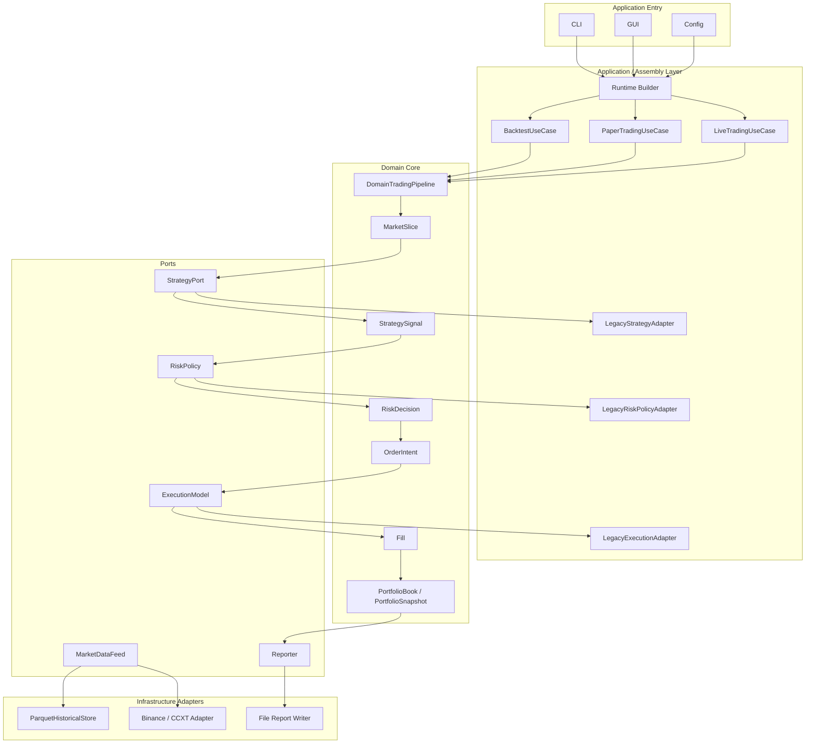

# 交易流水线完整解耦方案设计

日期：2026-06-09

关联文档：

- 需求文档：`docs/requirements/2026-06-09-trading-pipeline-domain-core-requirements.md`
- 第一阶段设计文档：`docs/design/2026-06-09-trading-pipeline-domain-core-design.md`
- 第二阶段设计文档：`docs/design/2026-06-09-trading-pipeline-phase-2-design.md`
- 第二阶段实施清单：`docs/worklist/2026-06-09-trading-pipeline-phase-2-worklist.md`

## 1. 背景

当前项目已经完成 Phase 1 到 Phase 10：

- 建立了领域模型、组合账本 `PortfolioBook`、本地 parquet store 和历史行情 feed。
- 抽出了 `BacktestUseCase`、`TradingPipeline` 和 `TradingReportUseCase`。
- 回测路径已经可以用本地 Binance 历史数据稳定跑通。
- paper mode 已经通过 base 入口复用当前 `TradingPipeline`。
- live mode 已经增加显式安全门，避免未确认配置时触达真实执行引擎。

当前基线：

- 回测区间：`2025-01-01` 到 `2025-01-02`
- 交易对和周期：`BTC/USDT 1m`
- 策略：`dual_ma`
- 回测引擎：`ohlcv`
- 最终净值：`99863.31403628497`
- 总交易数：`60`
- 买入交易数：`30`
- 卖出交易数：`30`
- 结束持仓：`{}`

但是当前状态仍是“兼容型解耦”，不是完整解耦。`src/application/trading_pipeline.py` 仍直接依赖 `mode/context`、`pandas.DataFrame`、旧策略接口、旧风控接口和旧执行引擎。

本设计的目标，是把交易主链路迁移到真正的领域协议：

```text
MarketSlice
-> StrategySignal
-> RiskDecision
-> OrderIntent
-> Fill
-> PortfolioSnapshot
-> Report
```

完成后，`DataFrame`、旧策略、旧风控、旧执行引擎都只能存在于 legacy adapter 内部，而不能泄漏进领域核心。

## 2. 问题审查

### 2.1 当前 TradingPipeline 还不是 Domain Core

当前 `TradingPipeline` 依赖：

- `context.state`
- `context.strategy.process_data(...)`
- `context.risk_manager.validate_signals(...)`
- `context.execution_engine.execute(...)`
- `context.portfolio_book`
- `context.config`
- `pandas.DataFrame`

这说明它已经从 mode 中迁出，但仍然是应用层兼容管道。它不能放在纯领域核心里。

### 2.2 策略层还没有解耦

当前策略基类接口是：

```python
async def process_data(self, data: pd.DataFrame, symbol: str) -> pd.DataFrame
```

策略仍直接输入和输出 `DataFrame`。虽然已有 `StrategySignalAdapter` 可以把旧信号转换成 `StrategySignal`，但主链路还没有真正使用 `StrategyPort`。

### 2.3 风控层还没有解耦

当前风控接口仍是：

```text
signals_df -> validate_signals -> signals_df
```

完整解耦后，风控应变成：

```text
StrategySignal + PortfolioSnapshot + MarketSlice -> RiskDecision
```

空仓卖出、超额卖出收缩、风控拒绝等逻辑也应属于风控策略，而不是散落在 pipeline 内部。

### 2.4 执行层还没有解耦

当前执行入口仍然是：

```python
execute(signals: pd.DataFrame) -> executed_orders_df
```

完整解耦后，执行层应变成：

```text
OrderIntent + MarketSlice + PortfolioSnapshot -> Fill
```

回测、模拟盘和实盘只替换 `ExecutionModel` 实现，不改变领域 pipeline。

### 2.5 报告层仍读 context 状态

`TradingReportUseCase` 已经从 mode 里抽出，但仍读取 mode/context 的 state。完整解耦后，报告应通过 `Reporter` 端口接收 `PortfolioSnapshot` 和 `Fill`，不再读取 mode 私有状态。

### 2.6 Runtime Builder 尚未形成

架构图中的 `Runtime Builder / Component Factory` 还没有统一承担组装职责。当前组装仍分散在 mode、factory 和 use case 中。

完整解耦后，运行时构建器应根据 config 创建：

- `MarketDataFeed`
- `StrategyPort`
- `RiskPolicy`
- `ExecutionModel`
- `Reporter`
- `PortfolioBook`
- `BacktestUseCase` / `PaperTradingUseCase` / `LiveTradingUseCase`

## 3. 解耦完成标准

以下标准同时满足时，才认为本阶段完成真正解耦。

### 3.1 领域核心边界

- `src/domain` 不依赖 `pandas`。
- `src/domain` 不依赖 `src.trading.modes`。
- `src/domain` 不依赖 `ConfigManager`。
- `src/domain` 不依赖 `ExecutionEngine`。
- `src/domain` 不依赖具体策略、具体风控、Binance、parquet 路径或报告文件路径。
- `src/domain` 只依赖标准库、领域模型和 ports。

### 3.2 主链路协议

主链路必须使用：

```text
MarketSlice -> StrategySignal -> RiskDecision -> OrderIntent -> Fill -> PortfolioSnapshot
```

`DataFrame` 只允许出现在：

- 历史数据 store 和 feed 的输入输出兼容层。
- legacy strategy adapter 内部。
- legacy risk adapter 内部。
- legacy execution adapter 内部。
- 报告落盘时的表格导出逻辑。

### 3.3 UseCase 边界

- `BacktestUseCase` 不再调用 mode 私有数据切片方法。
- `PaperTradingUseCase` 和 `LiveTradingUseCase` 独立存在。
- backtest、paper、live 共用同一条 `DomainTradingPipeline`。
- 三种模式只替换 feed、execution model 和运行控制策略。

### 3.4 mode 边界

mode 只负责：

- 初始化。
- 调用 runtime builder 或 use case。
- 安全门检查。
- shutdown。
- 兼容旧 CLI 返回结构。

mode 不再负责：

- 策略调用。
- 风控判断。
- 执行下单。
- 组合账本变更。
- 报告字段计算。

### 3.5 验证标准

每个 phase 必须至少验证：

- 聚焦单元测试。
- 完整单元测试。
- 基线回测。

关键边界 phase 还必须验证：

- import boundary tests。
- DataFrame 不泄漏到 domain pipeline。
- paper/live 不绕过 domain pipeline。

## 4. 目标架构



## 5. 关键设计决策

### 5.1 新增 DomainTradingPipeline，而不是继续改当前 TradingPipeline

当前 `src/application/trading_pipeline.py` 承担兼容职责。为了避免边改边破坏回测，应新增纯领域 pipeline：

候选路径：

- `src/domain/trading_pipeline.py`

当前 `src/application/trading_pipeline.py` 暂时保留，作为过渡兼容入口。等 backtest、paper、live 全部切换后，再考虑删除或降级为 legacy wrapper。

### 5.2 ports 使用 async 协议

策略、风控、执行、报告后续可能访问缓存、网络或文件。因此 ports 统一允许 async。

建议接口：

```python
class StrategyPort(Protocol):
    async def generate(self, market: MarketSlice, portfolio: PortfolioSnapshot) -> list[StrategySignal]:
        ...

class RiskPolicy(Protocol):
    async def evaluate(self, signal: StrategySignal, portfolio: PortfolioSnapshot, market: MarketSlice) -> RiskDecision:
        ...

class ExecutionModel(Protocol):
    async def execute(self, order_intent: OrderIntent, market: MarketSlice, portfolio: PortfolioSnapshot) -> Fill:
        ...

class Reporter(Protocol):
    async def record_snapshot(self, snapshot: PortfolioSnapshot) -> None:
        ...

    async def record_fill(self, fill: Fill) -> None:
        ...
```

`MarketDataFeed.load_range()` 可以保持同步 iterable，因为回测数据已经在本地；实时 feed 可使用 `latest()` 的 async 版本。

### 5.3 策略先适配，不重写

由于当前 `dual_ma` 只是跑通阶段策略，后续会替换，不应在本阶段深改其内部实现。

新增 `LegacyDataFrameStrategyAdapter`：

```text
MarketSlice -> DataFrame -> legacy_strategy.process_data -> DataFrame -> StrategySignal
```

这样可以让领域 pipeline 只看见 `StrategyPort`。

### 5.4 风控分两层

风控层分为：

- legacy risk adapter：兼容旧 `risk_manager.validate_signals(signals_df)`。
- domain risk policies：处理空仓卖出、超额卖出、仓位大小等领域规则。

推荐初期采用组合式风控：

```text
CompositeRiskPolicy
  -> LegacyRiskPolicyAdapter
  -> PositionAvailabilityPolicy
  -> SellQuantityClampPolicy
```

### 5.5 执行只处理成交，不修改组合

`ExecutionModel` 只返回 `Fill`，不直接修改 `PortfolioBook`。组合更新统一由 `DomainTradingPipeline` 调用 `PortfolioBook.apply_fill()` 完成。

这样可以确保：

- 回测执行模型只模拟成交。
- paper 执行模型只模拟成交。
- live 执行模型只把真实交易所回报转成 `Fill`。
- 现金、持仓、权益只在 PortfolioBook 中变化。

### 5.6 报告通过事件记录

Reporter 不再读 mode/context。它只接收：

- `PortfolioSnapshot`
- `Fill`
- run metadata

报告生成时从 reporter 自己记录的事件汇总。

### 5.7 Runtime Builder 最后落地

前几个 phase 可以手工在 use case 中组装，等接口稳定后再引入 Runtime Builder。这样避免在端口还未稳定时先建复杂工厂。

## 6. 分阶段方案

### Phase 11：解耦边界和 import boundary tests

目标：先定义什么叫“解耦完成”，并用测试守住边界。

主要工作：

- 新增 import boundary tests。
- 明确 `src/domain` 不允许依赖 pandas、mode、config、execution engine、具体 strategy/risk/data source。
- 更新 `src/domain/ports.py`，让 ports 与完整链路一致。
- 记录当前允许存在 DataFrame 的目录。

验收：

- 边界测试能检测 domain 误 import pandas。
- 完整测试通过。
- 基线回测不变。

### Phase 12：新增纯 DomainTradingPipeline

目标：建立不依赖 DataFrame 和 mode 的领域流水线。

主要工作：

- 新增 `src/domain/trading_pipeline.py`。
- pipeline 输入 `MarketSlice`，依赖 `StrategyPort`、`RiskPolicy`、`ExecutionModel`、`PortfolioBook`、`Reporter`。
- pipeline 输出 fills 和最新 `PortfolioSnapshot`。
- 使用 fake strategy、fake risk、fake execution、fake reporter 写纯领域单测。

验收：

- domain pipeline 单测不需要 pandas。
- domain pipeline 能完整跑通一轮：

```text
MarketSlice -> StrategySignal -> RiskDecision -> OrderIntent -> Fill -> PortfolioBook -> Reporter
```

### Phase 13：Legacy Strategy Adapter

目标：旧 DataFrame 策略不重写，但对领域 pipeline 表现为 `StrategyPort`。

主要工作：

- 新增 `src/application/adapters/legacy_strategy_adapter.py`。
- 将 `MarketSlice` 转成旧策略需要的单 symbol DataFrame。
- 调用 `legacy_strategy.process_data(data, symbol)`。
- 将输出 DataFrame 转成 `StrategySignal`。
- 保持现有 `DualMAStrategy` 行为不变。

验收：

- adapter 可以用 `DualMAStrategy` 产生稳定 `StrategySignal`。
- signal_id 去重逻辑稳定。
- 不改旧策略也能进入领域 pipeline。

### Phase 14：Legacy Risk Adapter 和领域风控规则

目标：把风控从 DataFrame 过滤迁到 `RiskDecision`。

主要工作：

- 新增 `src/application/adapters/legacy_risk_policy_adapter.py`。
- 新增 `src/domain/risk_policies.py`。
- 实现基础领域风控：
  - 空仓不能卖。
  - 超额卖出收缩到当前持仓。
  - 风控拒绝不生成订单意图。
- 支持组合式风控。

验收：

- 空仓卖出不会进入执行。
- 超额卖出会调整到当前持仓。
- `risk_accepted=False` 不会生成 `OrderIntent`。
- 原有相关测试迁移或补充到新接口。

### Phase 15：ExecutionModel 领域化

目标：执行入口从 DataFrame 信号迁到 `OrderIntent -> Fill`。

主要工作：

- 扩展或新增领域化 `BacktestExecutionModel`。
- 让它接收 `OrderIntent`、`MarketSlice`、`PortfolioSnapshot`。
- 返回 `Fill`。
- 保留旧 `ExecutionEngine.execute(signals_df)` 作为兼容入口。

验收：

- 回测成交模型可以单独用领域对象测试。
- 买入使用保守成交价，卖出使用保守成交价。
- 手续费和滑点计算与当前基线保持一致。

### Phase 16：BacktestUseCase 切换到 DomainTradingPipeline

目标：回测路径真正进入领域 pipeline。

主要工作：

- `BacktestUseCase` 组装或接收 `DomainTradingPipeline`。
- 回测循环消费 `MarketDataFeed.load_range()` 输出的 `MarketSlice`。
- 通过 legacy strategy/risk adapter 和领域 execution model 维持旧行为。
- `BacktestTradingMode` 只负责准备依赖和委托 use case。

验收：

- 基线回测仍然是 60 笔交易。
- 最终净值仍为 `99863.31403628497`，或若因领域化成交舍入产生差异，必须在 worklist 明确解释。
- `BacktestUseCase` 不再调用 mode 私有切片方法。

### Phase 17：PaperTradingUseCase 独立化

目标：paper mode 不再自己拥有交易循环，改为 use case + domain pipeline。

主要工作：

- 新增 `src/application/paper_trading_use_case.py`。
- 新增或适配 `RealtimeMarketDataFeed`。
- 新增 `PaperExecutionModel`，返回模拟 `Fill`。
- `PaperTradingMode` 委托给 use case。

验收：

- paper mode 一轮循环通过 domain pipeline。
- paper 不会真实下单。
- paper 和 backtest 共用同一个 `DomainTradingPipeline`。

### Phase 18：LiveTradingUseCase 独立化

目标：live mode 复用领域 pipeline，只替换实时 feed 和真实 execution model。

主要工作：

- 新增 `src/application/live_trading_use_case.py`。
- 新增 `LiveExecutionModel`，把交易所回报转成 `Fill`。
- 保留 live 双安全门。
- live mode 委托给 use case。

验收：

- 未设置双安全门时 live 仍拒绝启动。
- live use case 可用 fake exchange 做单测。
- live 不绕过 domain pipeline。

### Phase 19：Reporter 端口化

目标：报告不再读取 mode/context 状态。

主要工作：

- 新增或扩展 `Reporter` 实现。
- reporter 记录 `PortfolioSnapshot` 和 `Fill`。
- `TradingReportUseCase` 改为读取 reporter 记录或降级为兼容 wrapper。
- 保持当前 JSON 字段和文件名兼容。

验收：

- 报告字段与当前报告兼容。
- 报告生成不需要 mode.state。
- 回测报告仍写入 `reports/backtest`。

### Phase 20：Runtime Builder / Component Factory

目标：实现架构图中的运行时组装层。

主要工作：

- 新增 `src/application/runtime_builder.py`。
- 根据 config 和 mode 创建 feed、strategy port、risk policy、execution model、portfolio、reporter、use case。
- mode 改为调用 builder，减少手工组装。

验收：

- backtest/paper/live 的依赖组装入口统一。
- mode 文件明显变薄。
- CLI 运行方式不变。

## 7. 风险和控制

### 7.1 基线数值轻微变化风险

领域化执行模型可能暴露旧逻辑中的舍入或时间选择差异。控制方式：

- 每个 phase 都跑基线回测。
- 如果数值变化，必须定位原因。
- 如果变化是修正旧 bug，需在 worklist 记录旧值、新值和原因。

### 7.2 适配器堆叠过厚风险

过渡期会同时存在 legacy adapter 和新 ports。控制方式：

- 每个 adapter 都必须有明确删除条件。
- DataFrame 只能出现在 adapter 内部。
- 完成 Phase 20 后，评估删除旧 application TradingPipeline。

### 7.3 live 安全风险

实盘路径迁移时必须保留安全门。控制方式：

- live 初始化前先验证 `live_trading.enabled`。
- 再验证 `live_trading.confirm_live_trading`。
- live 单测必须证明未确认时不会创建真实 execution model。

### 7.4 文档和实现不同步风险

控制方式：

- 每完成一个 phase，更新 worklist。
- 每个 phase 记录修改文件、测试命令、测试结果、基线回测结果。

## 8. 推荐执行顺序

优先完成 Phase 11 到 Phase 16，使回测路径真正解耦。回测路径稳定后，再推进 Phase 17 到 Phase 20。

原因：

- 回测有稳定数据和可重复验证结果。
- 策略替换前，先把协议边界稳定下来更重要。
- paper/live 涉及实时循环和实盘安全，适合在领域 pipeline 稳定后迁移。

## 9. 非目标

本阶段不做：

- 优化 `dual_ma` 收益。
- 重写所有策略实现。
- 接入新交易所。
- 引入数据库。
- 重写 GUI。
- 改动用户现有 config 结构，除非 live 安全或 builder 组装确实需要新增默认项。

## 10. 结论

Phase 11 到 Phase 20 完成后，项目才能比较有把握地达到架构图中的完整解耦状态：

- Domain Core 不依赖 pandas、mode、config、交易所或文件系统。
- 策略层和执行层通过 ports 连接。
- DataFrame 被限制在 legacy adapter 和基础设施边界。
- backtest、paper、live 共用同一条领域流水线。
- PortfolioBook 是组合状态唯一事实来源。
- Reporter 通过快照和成交事件生成报告。
- Runtime Builder 统一负责组装运行时依赖。
