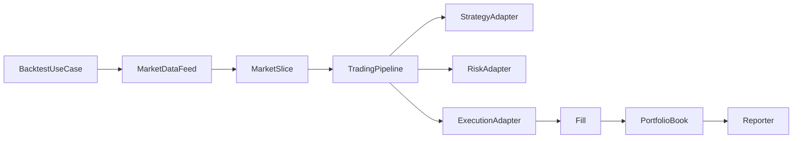
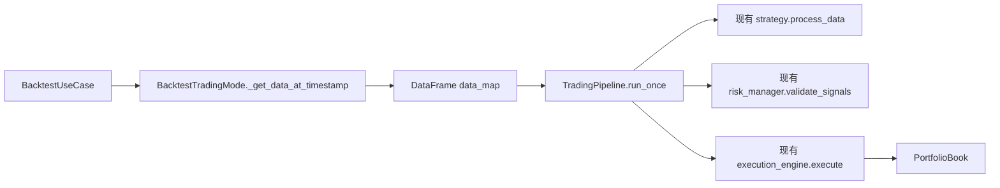

# 交易流水线第二阶段解耦方案设计

日期：2026-06-09

关联文档：

- 第一阶段需求文档：`docs/requirements/2026-06-09-trading-pipeline-domain-core-requirements.md`
- 第一阶段设计文档：`docs/design/2026-06-09-trading-pipeline-domain-core-design.md`
- 第一阶段实施清单：`docs/worklist/2026-06-09-trading-pipeline-domain-core-worklist.md`

## 1. 背景

第一阶段已经完成了领域模型、组合账本、回测成交模型、本地历史数据读取和回测用例编排的初步边界。

当前 `2025-01-01` 到 `2025-01-02` 的 `BTC/USDT 1m` 回测基线稳定：

- 最终净值：`99863.31403628497`
- 总交易数：`60`
- 买入交易数：`30`
- 卖出交易数：`30`
- 结束持仓：`{}`
- 最近已知报告：`reports/backtest/backtest_report_20260609_093604.json`

不过当前解耦仍是桥接式的。`BacktestUseCase` 已经抽出了 timestamp loop，但它仍依赖 mode 的私有方法。`BaseTradingMode` 仍然包含信号生成、信号过滤、风控校验、订单执行、组合更新和报告生成等核心流程。

第二阶段的目标，是把交易决策主流程从 mode 中迁出，让 mode 进一步变成组装层。

## 2. 当前剩余耦合点

### 2.1 `BaseTradingMode._process_market_data`

该方法当前仍同时负责：

- 从行情中更新时间。
- 更新组合市场价格。
- 调用策略。
- 过滤当前时间点信号。
- 处理信号去重。
- 调用风控。
- 过滤空仓卖出和超额卖出。
- 调用执行引擎。
- 将成交结果应用到组合账本。
- 更新净值和回撤。

这使策略、风控、执行和组合状态仍然通过 mode 间接耦合。

### 2.2 策略和风控仍依赖 DataFrame 协议

当前策略输出 DataFrame，风控也接收 DataFrame。领域模型中已有 `StrategySignal`、`RiskDecision` 和 `OrderIntent`，但还没有成为主路径协议。

第二阶段不应立即强行重写策略接口。更稳妥的做法是先通过 adapter 建立兼容层，再逐步把内部协议换成领域对象。

### 2.3 数据 feed 还没有进入回测主循环

`ParquetHistoricalStore`、`MarketDataNormalizer` 和 `MarketDataFeed` 已经存在，但主回测路径仍通过 `BacktestTradingMode._load_historical_data()` 和 `_get_data_at_timestamp()` 处理 DataFrame。

后续应让 `BacktestUseCase` 直接消费 `MarketDataFeed` 产生的 `MarketSlice`。

### 2.4 报告仍在 mode 内生成和保存

`BaseTradingMode._generate_report()`、`_save_report()` 和 `_log_report_summary()` 仍然是 mode 职责。报告模块应只消费组合状态、成交记录和运行元数据，不参与交易决策。

## 3. 第二阶段目标

第二阶段不是重写全系统，而是继续渐进迁移。

目标：

- 抽出交易决策主流程，形成 `TradingPipeline`。
- 让 `BaseTradingMode._process_market_data()` 变成兼容委托层。
- 保持当前策略、风控和执行接口可用。
- 在兼容层中逐步引入 `StrategySignal`、`RiskDecision`、`OrderIntent` 和 `Fill`。
- 让 `BacktestUseCase` 后续可以直接依赖 `MarketDataFeed`，减少对 mode 私有方法的依赖。
- 把报告生成和报告保存从 mode 中拆出。
- 保持 CLI 和基线回测行为不变。

非目标：

- 不在本阶段重写 `DualMAStrategy`。
- 不要求 paper/live 立刻进入同一 use case。
- 不修改用户现有 config 格式。
- 不引入数据库或新的外部服务。
- 不优化策略收益。

## 4. 推荐架构



短期兼容形态：



最终目标形态：


## 5. 关键组件

### 5.1 TradingPipeline

候选路径：`src/application/trading_pipeline.py`

职责：

- 接收当前市场数据。
- 调用策略产生信号。
- 过滤当前时间点信号。
- 去重已处理信号。
- 调用风控。
- 应用基本持仓约束。
- 调用执行适配器。
- 将成交应用到组合账本。
- 返回本轮成交记录。

第一步可以继续使用 DataFrame 作为输入输出，避免同时改动策略和风控。

建议接口：

```python
class TradingPipeline:
    async def run_once(self, data_map: dict[str, pd.DataFrame]) -> list[dict]:
        ...
```

### 5.2 StrategyAdapter

候选路径：`src/application/adapters/strategy_adapter.py`

职责：

- 包装当前策略对象。
- 初期仍返回 DataFrame。
- 后续将 DataFrame 转成 `StrategySignal`。

第二阶段初期可以不单独建文件，先让 `TradingPipeline` 使用现有策略接口。等 pipeline 边界稳定后再抽 adapter。

### 5.3 RiskAdapter

候选路径：`src/application/adapters/risk_adapter.py`

职责：

- 包装当前 risk manager。
- 初期仍调用 `validate_signals(signals)`。
- 后续输出 `RiskDecision`。

### 5.4 ExecutionAdapter

候选路径：`src/application/adapters/execution_adapter.py`

职责：

- 包装当前 `ExecutionEngine`。
- 将现有 executed orders 转成交易记录或 `Fill`。
- 后续让 pipeline 直接依赖 `ExecutionModel` port。

### 5.5 ReportUseCase / Reporter

候选路径：

- `src/application/report_use_case.py`
- `src/reporting/backtest_reporter.py`

职责：

- 从 `PortfolioBook`、成交记录、equity curve 和运行参数生成报告。
- 保存 JSON/CSV/图表。
- 打印摘要日志。

报告不应修改组合状态。

## 6. 分阶段实施建议

### Phase 6：抽出 TradingPipeline

目标：将 `_process_market_data()` 的主体迁出 `BaseTradingMode`。

边界：

- `BaseTradingMode._process_market_data()` 保留，但只负责创建或调用 `TradingPipeline`。
- 不修改策略返回格式。
- 不修改风控输入格式。
- 不修改执行引擎公开行为。

验证：

- 当前 timestamp 只执行当前信号。
- 同一个信号不会重复执行。
- 空仓卖出被跳过。
- 超额卖出被缩小到当前持仓。
- 执行后的成交进入 `PortfolioBook`。
- 基线回测数值不变。

### Phase 7：引入 Signal/Risk 兼容 adapter

目标：让策略和风控边界可替换，但仍兼容现有 DataFrame。

边界：

- 新增 `StrategySignalAdapter`，负责 DataFrame 和 `StrategySignal` 的转换。
- 新增 `RiskDecisionAdapter`，负责 DataFrame 风控结果和 `RiskDecision` 的转换。
- 主路径仍可保留 DataFrame，直到策略替换前再切换为领域对象。

验证：

- DataFrame 策略输出可以生成稳定 signal id。
- 重复 signal id 不会重复执行。
- 风控拒绝的信号不会进入执行。

### Phase 8：BacktestUseCase 直接消费 MarketDataFeed

目标：让回测用例不再依赖 mode 的历史数据切片私有方法。

边界：

- `BacktestUseCase` 通过 feed 加载或遍历数据。
- `BacktestTradingMode` 只负责组装 feed、pipeline 和 reporter。
- 保留旧方法作为过渡兼容，直到新路径稳定。

验证：

- `2025-01-01` 到 `2025-01-02` 的 `BTC/USDT 1m` feed 仍能得到 1441 个时间点。
- 基线回测报告数值不变。

### Phase 9：抽出 ReportUseCase

目标：让报告生成和保存离开 `BaseTradingMode`。

边界：

- `BaseTradingMode._generate_report()` 和 `_save_report()` 先委托给 reporter。
- 保持报告 JSON 字段兼容当前结果。
- 先不改报告文件命名规则。

验证：

- JSON 报告仍写入 `reports/backtest`。
- 报告字段包含 `initial_capital`、`final_equity`、`total_trades`、`buy_trades`、`sell_trades`、`current_positions`。
- 基线回测报告数值不变。

### Phase 10：paper/live 复用同一 pipeline

目标：让 paper/live 和 backtest 共享交易决策流程。

边界：

- paper 使用实时或准实时 data feed，加模拟执行模型。
- live 使用实时 data feed，加真实交易所执行适配器。
- live 必须要求显式安全开关，默认不能实盘下单。

验证：

- paper mode 可以在不连接真实下单接口的情况下跑通一次循环。
- live mode 没有显式 live enable 配置时拒绝启动。
- backtest 基线仍不变。

## 7. 风险和约束

### 7.1 最大风险：一次改动过大

不要同时修改策略协议、风控协议、执行协议和报告输出。每个阶段只移动一个边界。

### 7.2 最大行为约束：基线回测不能漂移

每个阶段必须运行：

```powershell
$env:PYTHONIOENCODING='utf-8'
$env:PYTHONPATH='E:\myProgram\crypto_trader\src;E:\myProgram\crypto_trader'
.\.venv\Scripts\python.exe -m unittest discover tests
```

以及：

```powershell
$env:PYTHONIOENCODING='utf-8'
$env:PYTHONPATH='E:\myProgram\crypto_trader\src;E:\myProgram\crypto_trader'
.\.venv\Scripts\python.exe -m src.main --cli --config conf/config.yaml --mode backtest --strategy dual_ma --symbol "BTC/USDT" --timeframe 1m --start-date 2025-01-01 --end-date 2025-01-02 --backtest-engine ohlcv
```

预期仍为：

- 最终净值：`99863.31403628497`
- 总交易数：`60`
- 买入：`30`
- 卖出：`30`
- 结束持仓：`{}`

### 7.3 保留旧接口作为迁移垫片

短期内允许 mode 保留旧方法，但旧方法内部应逐步变成委托。这样既能降低风险，也能让旧测试继续保护行为。

## 8. 推荐下一步

下一步进入 Phase 6：抽出 `TradingPipeline`。

执行原则：

- 先写测试证明 `BaseTradingMode._process_market_data()` 委托给 pipeline。
- 再写 `TradingPipeline.run_once()` 的行为测试。
- 最小迁移 `_process_market_data()` 内部逻辑。
- 跑完整单元测试和 1 天基线回测。
- 更新第二阶段 worklist。
